## 1. 实验要求

### Assignment 1

#### 1.1

复现Example 1，说说你是怎么做的并提供结果截图，也可以参考Ucore、Xv6等系统源码，实现自己的LBA方式的磁盘访问。

#### 1.2

在Example1中，我们使用了LBA28的方式来读取硬盘。此时，我们只要给出逻辑扇区号即可，但需要手动去读取I/O端口。然而，BIOS提供了实模式下读取硬盘的中断，其不需要关心具体的I/O端口，只需要给出逻辑扇区号对应的磁头（Heads）、扇区（Sectors）和柱面（Cylinder）即可，又被称为CHS模式。现在，同学们需要将LBA28读取硬盘的方式换成CHS读取，同时给出逻辑扇区号向CHS的转换公式。最后说说你是怎么做的并提供结果截图。

### Assignment 2

复现Example 2，使用gdb或其他debug工具在进入保护模式的4个重要步骤上设置断点，并结合代码、寄存器的内容等来分析这4个步骤，最后附上结果截图。gdb的使用可以参考appendix的“debugwithgdbandqemu”部份。

### Assignment 3

改造“Lab2-Assignment 4”为32位代码，即在保护模式后执行自定义的汇编程序。


---

## 2. 实验过程

### Assignment 1.1

对于 Assignment 1.1，复制 src 中 example-1 文件到当前目录下，执行 `make build` 和 `make run` 来编译和运行程序。可以在下图看到，MBR 被执行并正确加载了 Bootloader，显示了青色 `run boootloader` 的提示。


### Assignment 1.2

Assignment 1.2 需要将 LBA28 的方式换成 CHS 方式来读取硬盘。

首先，查阅资料得知 LBA 和 CHS 的关系，有如下公式：

```
C = LBA / (HPC * SPT)
H = (LBA % (HPC * SPT)) / SPT
S = (LBA % (HPC * SPT)) % SPT + 1
```

其中，C 是柱面号，H 是磁头号，S 是扇区号。slide 中提到了 SPT = 63，HPC = 18。

利用上述公式，求出 CHS 后，调用中断 `int 0x13` 来读取硬盘。可以在下图看到，MBR 被执行并正确加载了 Bootloader，显示了青色 `run boootloader` 的提示。

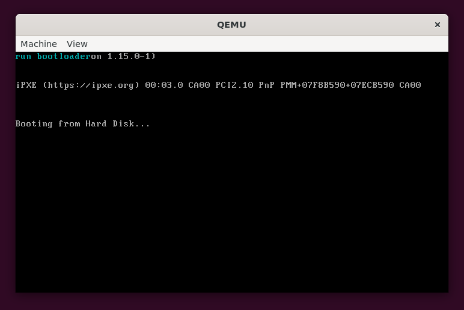

### Assignment 2

复制 example-2 文件到当前目录下，执行 `make build` 来编译程序。

但直接编译会有错误。在 `bootloader.asm` 文件中的第二行，`org 0x7e00` 语句无法在 nasm 的 `-f elf32` 模式下被识别。但是观察 makefile 会发现 `make build` 里的 nasm 指令指定了 `-Ttext 0x7e00`，因此不需要 `org` 语句。将 `org 0x7e00` 注释掉后，重新编译即可。

编译后执行 `make debug` 后台运行 qemu，并使用 gdb 连接到 qemu。下图是 GDB 环境，左侧是供对照的代码片段。按照 slide 中的步骤，在进入保护模式的 4 个重要步骤上设置断点（如左侧程序 `b1:`、`b2:`、`b3:`、`b4:` 标签处）。

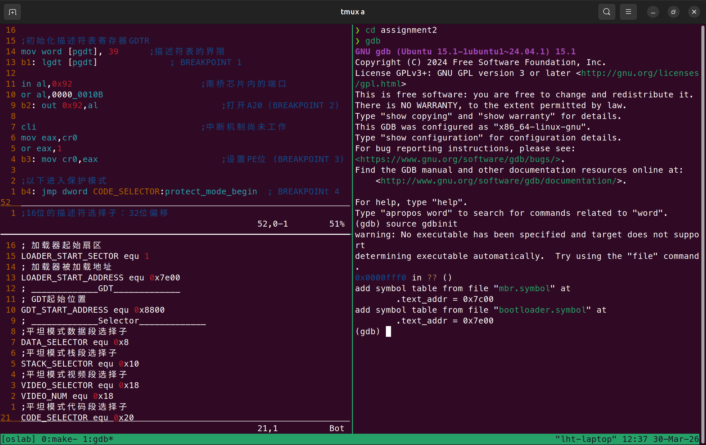

首先 `continue` 后，程序在 `b1` 处停下，此时可以查看寄存器的内容，发现 `GDTR` 为 0 值。如下图：

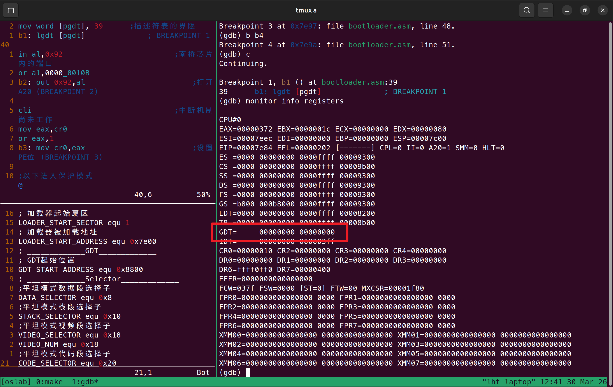

使用 `si` 命令执行 `lgdt [gdtr]` 来加载 GDTR 寄存器，此时 GDTR 的值被正确加载。如下图：

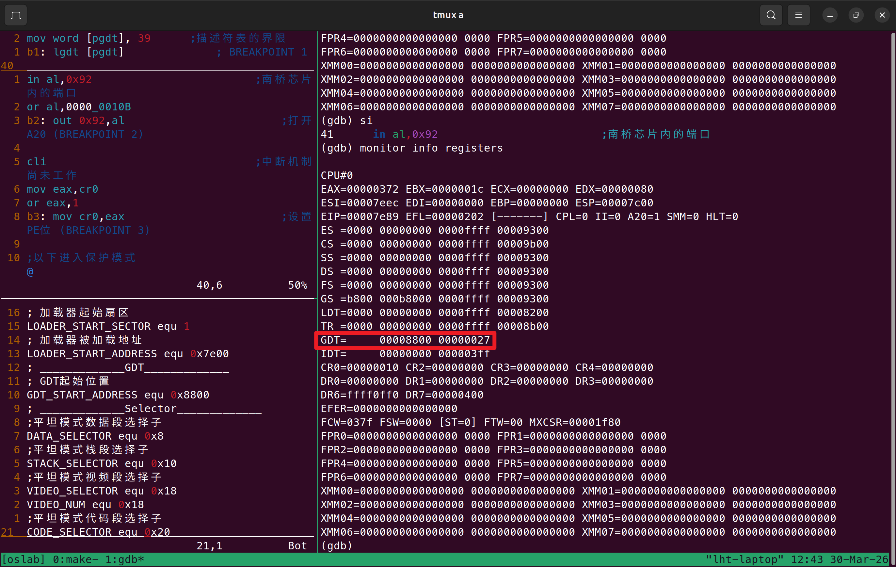

继续 `continue` 后，程序在 `b2` 处停下，此时可以查看寄存器 `al` 的内容，应该为 `0x02`，表示打开 A20 门。如下图：

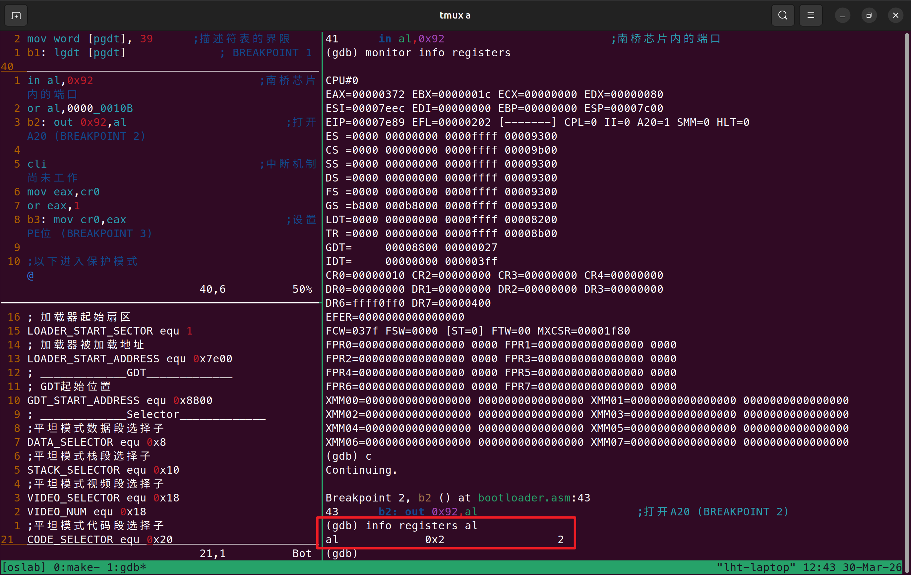

继续 `continue` 后，程序在 `b3` 处停下，此时可以查看寄存器 `cr0` 的内容，应该为 `0x10`，PE 位还未被设置。如下图：

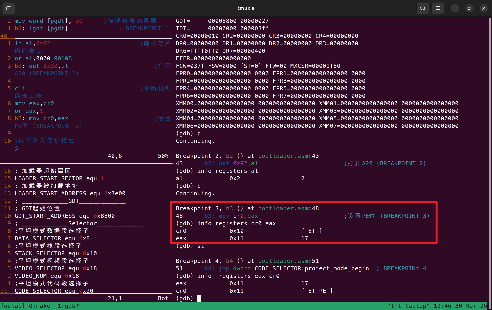

使用 `si` 命令执行 `mov cr0, eax` 来设置 PE 位，此时 `cr0` 的值被正确设置。如下图：

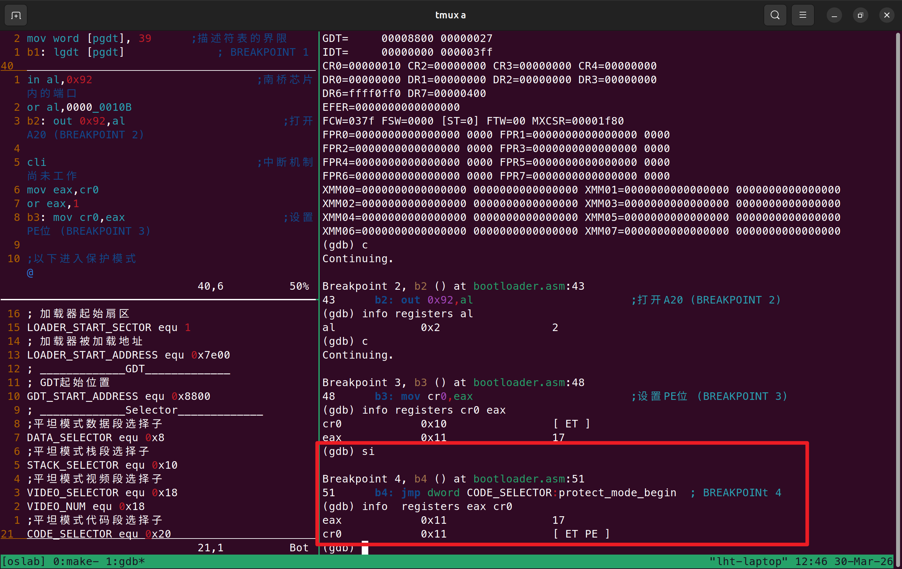

在进入保护模式前，可以 `b4` 断点处检查段寄存器的内容，可以发现 `cs`, `ds`, `es`, `ss` 的值都是 0，还未被设置。如下图：

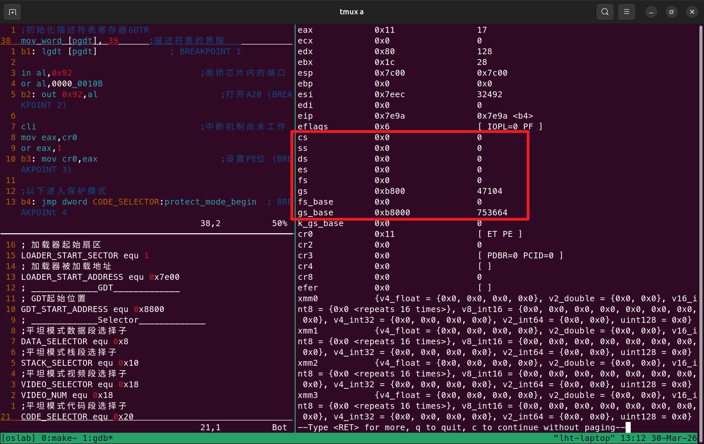

随后执行 `continue`，程序正常执行，可以看到 qemu 窗口显示了 `enter protect mode` 的提示，检查段寄存器内容，发现值已经被正确设置。如下图：

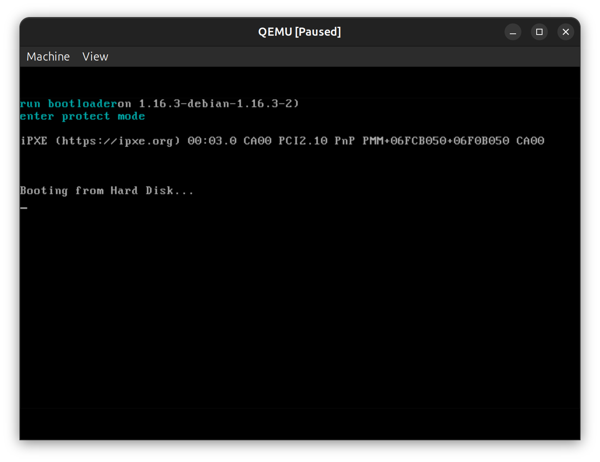

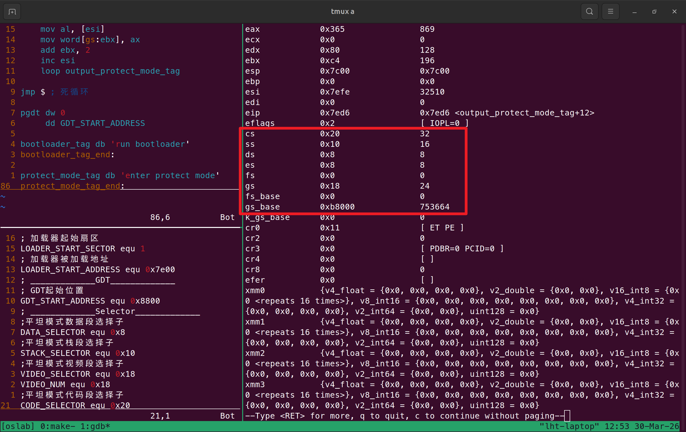

至此实验 Assignment 2 完成。

### Assignment 3

复用 Assignment 2 的代码，在进入保护模式后执行自定义的汇编程序。修改 lab2-assignment4 的 `bounce.asm` 文件，添加到 bootloader 的 32bit 保护模式下。

程序的主要变化为：

| 16 位实模式 | 32 位保护模式 | 说明 |
| --- | --- | --- |
| `ax, bx, cx, dx` | `eax, ebx, ecx, edx`  | 寄存器名称变化 |
| `mul word [const80]` | `imul eax, 80` | 乘法指令更方便 |

修改后，重新编译并运行程序，可以看到 qemu 窗口正常运行了字符弹射程序，如下图。

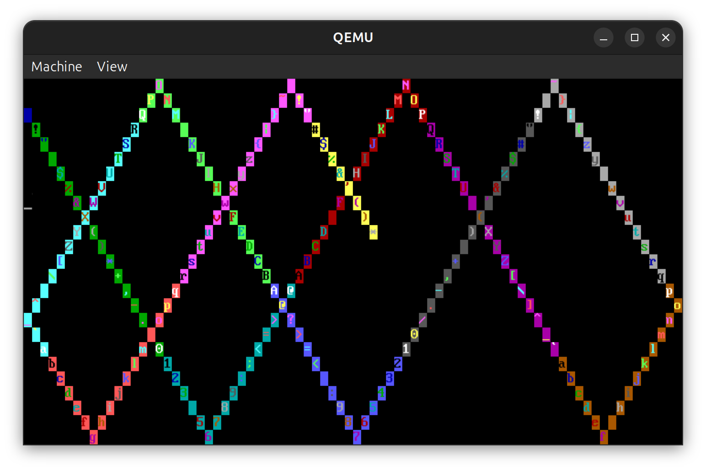
---

## 关键代码

Assignment 1.2 中 LBA 转 CHS 的代码及其说明：

```asm
; ========== CHS模式读取硬盘函数 ==========
; 参数：
;   ax = LBA逻辑扇区号
;   es:bx = 目标内存地址
; 使用：
;   SPT = 63 (每磁道扇区数)
;   HPC = 18 (每柱面磁头数)
asm_read_hard_disk_chs:

    push cx
    push ax
    push bx
    ; 计算扇区号：(LBA mod 63) + 1
    xor dx, dx
    mov cx, 63           ; SPT
    div cx               ; AX = LBA / 63, DX = LBA mod 63
    inc dx               ; DX = 扇区号
    mov cl, dl           ; CL = 扇区号
    
    ; 现在 AX = LBA / 63
    ; 磁头号 = (LBA / 63) mod 18
    xor dx, dx
    mov bx, 18           ; HPC
    div bx               ; AX = 柱面号, DX = 磁头号
    mov dh, dl           ; DH = 磁头号
    
    ; 柱面号 = LBA / (SPT * HPC) = LBA / (63 * 18) = LBA / 1134
    mov ch, al           ; CH = 柱面号低8位
    shl ah, 6
    or cl, ah            ; CL高2位 = 柱面号高2位

    pop bx

    ; 调用BIOS中断
    mov dl, 0x80         ; 驱动器号：第一块硬盘
    mov ax, 0x0201       ; AH=02h(读), AL=01h(1个扇区)
    int 0x13             ; BIOS磁盘中断

    pop ax
    pop cx
    
    ret
```

Assignment 3 中 32 位代码的关键部分：

```asm
; ========== 32位保护模式部分 ==========
[bits 32]           
protect_mode_begin:
    ; 初始化段寄存器
    mov eax, DATA_SELECTOR
    mov ds, eax
    mov es, eax
    mov eax, STACK_SELECTOR
    mov ss, eax
    mov esp, 0x7c00
    mov eax, VIDEO_SELECTOR
    mov gs, eax

    ; 清屏
    call clear_screen

    ; 初始化弹射变量
    mov byte [row], 2
    mov byte [col], 0
    mov byte [dr], 1
    mov byte [dc], 1
    mov byte [attr], 0x1F
    mov byte [chr], 0x20

; ========== 主循环：字符弹射 ==========
main_loop:
    ; 计算显存位置: (row * 80 + col) * 2
    xor eax, eax
    mov al, [row]           ; eax = row
    imul eax, 80            ; eax = row * 80
    
    xor ebx, ebx
    mov bl, [col]           ; ebx = col
    add eax, ebx            ; eax = row * 80 + col
    shl eax, 1              ; eax *= 2 (每个字符2字节)
    mov edi, eax            ; edi = 显存偏移

    ; 写入字符到显存
    mov al, [chr]           ; AL = 字符
    mov ah, [attr]          ; AH = 属性
    mov word [gs:edi], ax

    ; 延迟（32位版本）
    mov ecx, 0x001fffff     ; 外层循环
delay:
    nop
    dec ecx
    jnz delay

    ; 更新字符（0x20~0x7e循环）
    inc byte [chr]
    mov al, [chr]
    cmp al, 0x7f
    jne .chr_not_last
    mov byte [chr], 0x20
.chr_not_last:

    ; 更新属性（自然溢出）
    inc byte [attr]

    ; 更新行位置（带边界检测）
    mov al, [row]
    movsx eax, al           ; 符号扩展到32位
    mov bl, [dr]
    movsx ebx, bl
    add eax, ebx            ; row += dr
    
    cmp al, 25              ; 到达底部？
    jne .row_not_bottom
    mov al, 23
    neg byte [dr]
.row_not_bottom:
    cmp al, -1              ; 到达顶部？
    jne .row_store
    mov al, 1
    neg byte [dr]
.row_store:
    mov [row], al

    ; 更新列位置（带边界检测）
    mov al, [col]
    movsx eax, al
    mov bl, [dc]
    movsx ebx, bl
    add eax, ebx            ; col += dc
    
    cmp al, 80              ; 到达右边？
    jne .col_not_right
    mov al, 78
    neg byte [dc]
.col_not_right:
    cmp al, -1              ; 到达左边？
    jne .col_store
    mov al, 1
    neg byte [dc]
.col_store:
    mov [col], al

    jmp main_loop           ; 无限循环
```

---

## 实验结果

### Assignment 1.1 结果

成功复现 Example 1。系统启动后 MBR 正常执行并成功加载 Bootloader，屏幕显示青色 run boootloader 提示。说明 LBA 读取与跳转流程正确。


### Assignment 1.2 结果

将 LBA28 读取方式替换为 CHS + int 0x13 后，系统仍可正常加载 Bootloader，并显示相同提示。说明 LBA 到 CHS 转换公式实现正确，CHS 读盘逻辑可用。


### Assignment 2 结果

在进入保护模式的 4 个关键步骤设置断点并完成验证：

- lgdt 执行前后 GDTR 从未初始化到正确加载；
- A20 步骤中 al 为 0x02；
- 设置 PE 前后 cr0 由 0x10 变为 PE 位置位状态；
- 长跳转与段寄存器重装后，成功进入保护模式并显示 enter protect mode。
说明保护模式切换流程正确、关键寄存器状态符合预期。

实验过程中使用 gdb 的结果可以见第 2 节实验过程 Assignment 2 的截图。

### Assignment 3 结果

将字符弹射程序迁移到 32 位保护模式后可正常运行，QEMU 中可观察到字符在屏幕内弹射、字符和属性持续变化。说明 32 位寄存器、寻址与显存写入逻辑正确。


---

## 总结

主要的问题在于 example 2 中的 `org 0x7e00` 语句无法在 nasm 的 `-f elf32` 模式下被识别，下发代码无法通过编译。解决方法是注释掉该行代码，查询大模型发现 `-Ttext 0x7e00` 选项指定了代码的物理地址，不需要使用 `org` 来设置段内偏移。修改后代码成功编译并运行，完成了 Assignment 2 的实验要求。

本次实验学习到了：

1. LBA 和 CHS 之间的关系及转换公式；
2. BIOS 中断 `int 0x13` 的使用方法；
3. 保护模式切换的关键步骤和相关寄存器状态；
4. gdb 在 QEMU 中调试引导程序的基本方法；
5. 32 位保护模式下的寄存器使用和显存操作。


---

## 注

1. 请在报告首页填写好相关信息。
2. 实验报告需要将必要的实验过程和结果通过截图等方式放入报告内。并且可以在总结处附上自己解决问题的过程。
3. 锻炼实践能力，尽量自主解决遇到的问题，切忌抄袭。
4. 请将实验报告导出为PDF文件，并命名为 **学号+姓名.pdf** (如 `21210001李华.pdf`)
