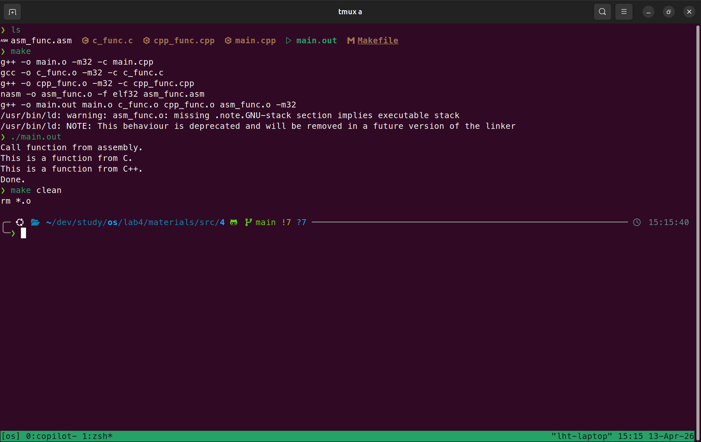
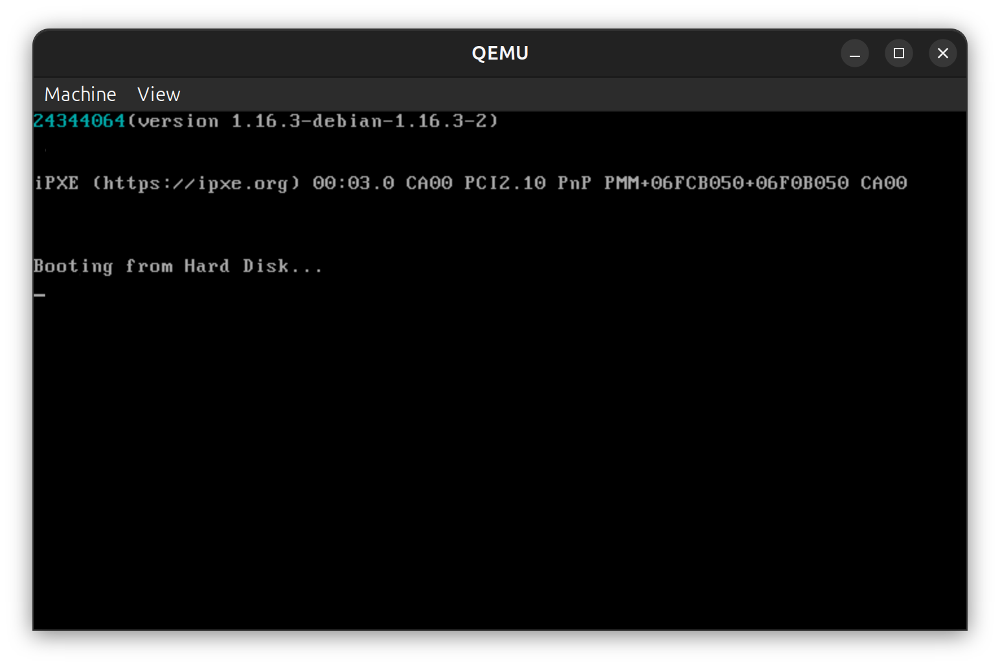
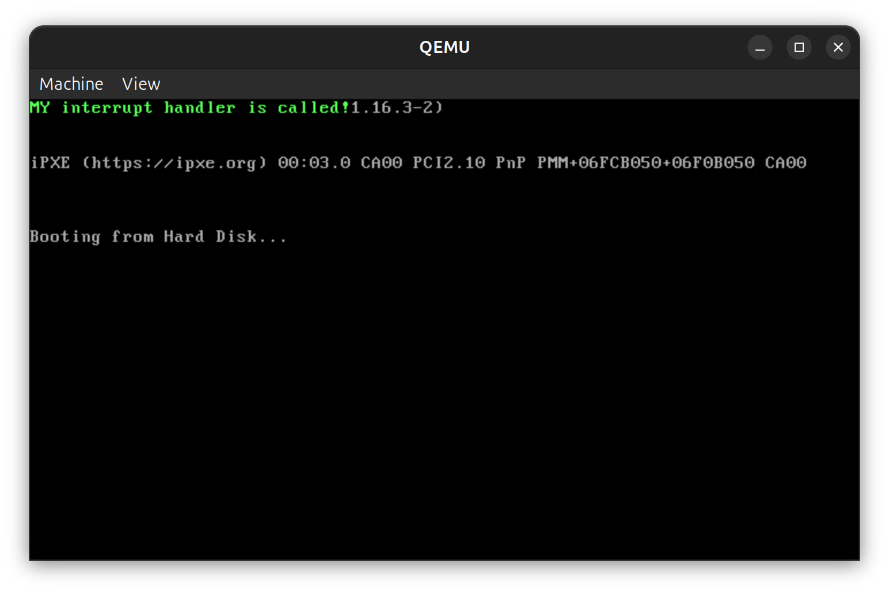
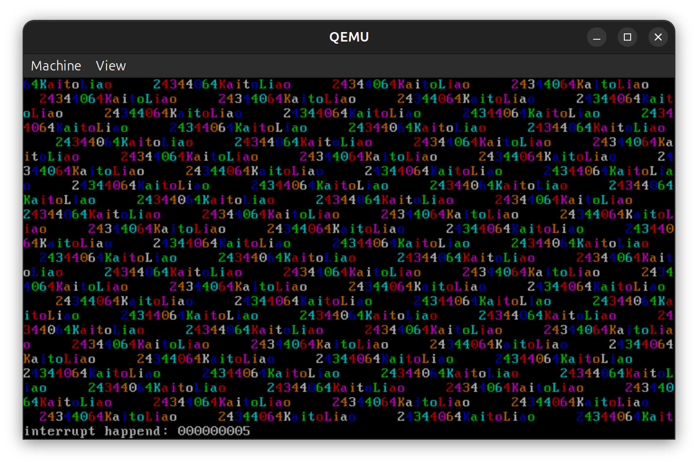

## 实验要求

1. 完成 4 个 assignment（对应 `materials/src/4~7`）。
2. 报告中需要包含必要过程、关键代码和结果截图。
3. Assignment 2：在 `setup_kernel` 后输出学号信息。
4. Assignment 3：实现并触发自定义中断处理。
5. Assignment 4：使用 C/C++ + InterruptManager + STDIO 完成时钟中断显示逻辑。

---

## 实验过程

### Assignment 1：混合编程

汇编代码中：

- `extern` 的作用是，告诉汇编编译器这些函数是在其他地方定义的（通常是 C/C++ 代码中），并且在链接阶段需要解析它们的地址。如 `extern function_from_C` 表示 `function_from_C` 是一个外部函数，链接器会在链接阶段找到它的定义并将其地址填充到调用处。
- `global` 的作用是将汇编函数导出为全局符号，使 C/C++ 代码在链接阶段能够正确调用它们。如 `global function_from_asm` 表示 `function_from_asm` 是一个全局符号，链接器会将其地址暴露给其他模块（如 C/C++ 代码）使用。

使用 `extern "C"` 是为了告诉 C++ 编译器不要对函数名进行 C++ 风格的名字改编，确保汇编代码能够正确链接到这些函数。如 `extern "C" void function_from_CPP()` 表示让编译器按照 C 风格命名函数，避免 C++ 的名字改编。


使用 `makefile` 构建：

```bash
make
./main.out
```

执行效果如图所示：



### Assignment 2：C/C++ 内核输出学号

考虑在 C++ 中直接写显存 `0xb8000`，输出学号风格字符串。

代码实现如下：

```cpp
extern "C" void setup_kernel() {
    const char studentId[] = "24344064";
    volatile unsigned short *video = (unsigned short *)0xb8000;
    for (int i = 0; studentId[i] != '\0'; ++i) {
        video[i] = (0x03 << 8) | (unsigned char)studentId[i];
    }
    // ...
}
```

效果如下图所示：



### Assignment 3：自定义中断处理

考虑编写一个简单的中断处理函数，用以显示中断被触发的消息。实现如下：

```asm
asm_my_interrupt_handler:
    cli ; 关中断
    call my_interrupt_handler
    jmp $ ; 死循环
```

这里的 my_interrupt_handler 是一个 C++ 函数，通过直接写入显存在屏幕上显示消息，实现如下：

```cpp
extern "C" void my_interrupt_handler() {
    const char info[] = "MY interrupt handler is called!";
    volatile uint16 *screen = (uint16 *)0xb8000;
    for (int i = 0; info[i] != '\0'; ++i) {
        screen[i] = (0x0c << 8) | (unsigned char)info[i];
    }
}
```

构建后效果如下：



### Assignment 4：时钟中断动态显示

考虑在时钟中断处理函数中用 C++ 逻辑生成跑马灯。稍微修改一下 `c_time_interrupt_handler` 函数，让前面 24 行显示滚动文本，最后一行仍保留 `timer interrupt ticks` 计数。

效果如下：



---

## 关键代码

### 1. Assignment 2：显存输出学号

```cpp
const char studentId[] = "24344064";
volatile unsigned short *video = (unsigned short *)0xb8000;
for (int i = 0; studentId[i] != '\0'; ++i) {
    video[i] = (0x03 << 8) | (unsigned char)studentId[i];
}
```

说明：通过直接写显存完成内核阶段字符串显示。

### 2. Assignment 3：中断向量注册与触发

```asm
; assemble handler
asm_my_interrupt_handler:
    cli
    call my_interrupt_handler
    jmp $
```

```cpp
extern "C" void my_interrupt_handler() {
    const char info[] = "MY interrupt handler is called!";
    volatile uint16 *screen = (uint16 *)0xb8000;

    for (int i = 0; info[i] != '\0'; ++i)
    {
        screen[i] = (0x0a << 8) | (uint8)info[i];
    }
}
```

### 3. Assignment 4：时钟中断跑马灯

```cpp
extern "C" void c_time_interrupt_handler() {
    int textLength = sizeof(marqueeText) - 1;
    const int marqueeRows = 24;
    for (int row = 0; row < marqueeRows; ++row)
    {
        for (int col = 0; col < 80; ++col)
        {
            int index = (row * 80 + col + marqueeOffset) % textLength;
            stdio.print(row, col, marqueeText[index], ((row + col) % 7) + 1);
        }
    }
    marqueeOffset = (marqueeOffset + 1) % textLength;

    ++times;
    char str[] = "interrupt happend: ";
    char number[10];
    int temp = times;

    // 将数字转换为字符串表示
    for(int i = 0; i < 10; ++i ) {
        if(temp) {
            number[i] = temp % 10 + '0';
        } else {
            number[i] = '0';
        }
        temp /= 10;
    }

    stdio.moveCursor(24, 0);
    for(int i = 0; str[i]; ++i ) {
        stdio.print(str[i]);
    }

    // 输出中断发生的次数
    for( int i = 9; i > 0; --i ) {
        stdio.print(number[i]);
    }
}
```

说明：每次中断更新偏移量，实现滚动显示。

---

## 实验结果

1. Assignment 1：终端成功输出 C、C++、汇编联调结果。  
   

2. Assignment 2：QEMU 第一行显示学号字符串。  
   

3. Assignment 3：QEMU 显示 `My interrupt handler is called!`。  
   

4. Assignment 4：QEMU 第一行跑马灯滚动，第二行 tick 递增。  
   

---

## 总结

本实验完成了从混合编程到保护模式中断处理、再到 8259A 时钟中断应用的完整链路。关键收获：

1. 理解了 C/C++ 与汇编在链接层面的协作方式（`extern/global/extern "C"`）。
2. 掌握了 IDT 描述符注册与软件触发中断的最小闭环。
3. 能够使用 C++ 代码在中断上下文中驱动屏幕动态效果，满足“非纯汇编”的实验要求。

