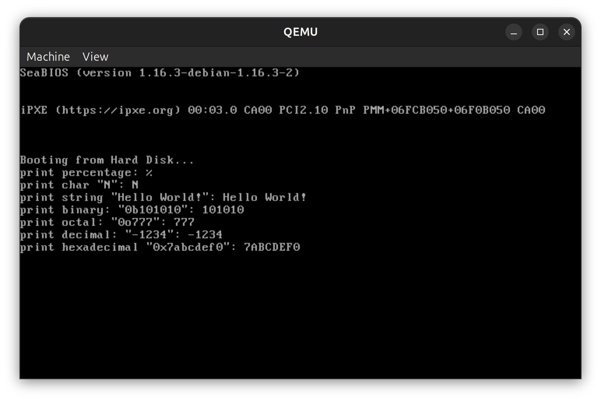

# 操作系统实验 Lab5 - 内核线程与进程调度

## 实验要求

- Assignment 1: printf 的实现
- Assignment 2: 内核线程的实现
- Assignment 3: 线程调度上下文切换的秘密
- Assignment 4: 调度算法的实现

---

## 实验过程

### Assignment 1：printf 的实现

printf 函数的实现需要：

1. 使用 `va_start` 初始化参数指针
2. 逐字符扫描格式字符串
3. 遇到 `%` 时，根据后续字符确定类型
4. 使用 `va_arg` 获取对应的参数
5. 将参数转换为字符串后输出

支持的格式说明符大部分和资料一样，本项作业新增了二进制和八进制的支持：

| 说明符 | 含义 | 处理方式 |
| --- | --- | --- |
| %% | 百分号 | 输出单个百分号 |
| %c | 单个字符 | 直接取第一个字符 |
| %s | 字符串 | 获取指针并逐字符输出 |
| %b | 二进制 | 将 int 转换为二进制字符串 |
| %o | 八进制 | 将 int 转换为八进制字符串 |
| %d | 十进制整数 | 将 int 转换为十进制字符串 |
| %x | 十六进制 | 将 int 转换为十六进制字符串 |

### Assignment 2：内核线程的实现

#### 2.1 PCB 结构设计

实际上，PCB 在这里更准确地称为 TCB，因为我们实现的是线程而非进程。TCB 结构包含以下字段：

```cpp
struct TCB {
    uint32 id;              // 线程 ID
    uint32 *stack;          // 栈指针
    enum ThreadState state; // 线程状态
    uint32 stackSize;       // 栈大小
    ThreadContext context;  // 寄存器上下文
    ThreadState state;      // 线程状态
    uint32 priority;        // 优先级
};
```

**ThreadContext 结构：**

```cpp
struct ThreadContext {
    uint32 esp;  // 栈指针
    uint32 ebp;  // 基指针
    uint32 eax, ebx, ecx, edx;  // 通用寄存器
    uint32 esi, edi;            // 索引寄存器
    uint32 eip;  // 指令指针
};
```

#### 2.2 线程创建过程

1. **从线程池分配 TCB**：维护一个最多 10 个线程的池
2. **分配栈空间**：使用 malloc 分配指定大小的栈
3. **初始化上下文**：
   - 设置 ESP 指向栈顶
   - 设置 EIP 为线程入口点
   - 其他寄存器初始化为 0
4. **管理线程状态**：新创建的线程状态设为 READY

#### 2.3 线程局部存储

- 使用全局指针 `currentThread` 指向当前执行的线程
- 每个线程有独立的 TCB 结构，存储其完整的上下文
- 通过 `thread_current()` 获取当前线程

### Assignment 3：线程调度上下文切换

#### 3.1 上下文切换机制

在时钟中断发生时：

1. **中断处理器保存寄存器**：CPU 自动保存返回地址
2. **保存线程上下文**：将当前线程的所有寄存器保存到其 TCB
3. **调度选择**：选择下一个就绪的线程
4. **恢复上下文**：将选中线程的寄存器从其 TCB 恢复
5. **恢复执行**：从上次中断处继续执行选中的线程

#### 3.2 栈帧布局

中断时的栈帧结构：

```
中断入口时
  [EIP]  ← 中断服务例程地址
  [CS]   ← 代码段
  [EFLAGS] ← 标志寄存器

中断处理器保存的寄存器（可选）
  [EAX]
  [EBX]
  ...
```

#### 3.3 gdb 调试

可以在以下位置设置断点观察上下文切换：
- 中断处理器入口：观察到中断发生
- 上下文保存前：查看当前寄存器值
- 上下文恢复后：查看即将执行的线程寄存器值

### Assignment 4：调度算法的实现

#### 4.1 就绪队列

使用循环队列（circular queue）实现就绪队列：

```cpp
typedef struct {
    thread_t *threads[MAX_READY_QUEUE];
    uint32 head;   // 队头指针
    uint32 tail;   // 队尾指针
    uint32 count;  // 队列中的线程数
} ReadyQueue;
```

#### 4.2 FCFS（先来先服务）调度

- **原理**：按照线程加入就绪队列的顺序执行
- **实现**：从队头取出一个线程，执行完全后再取下一个
- **优点**：实现简单，公平性好
- **缺点**：不适合交互式系统

```cpp
thread_t* schedule_fcfs(void) {
    if (readyQueue.count == 0) return NULL;
    
    thread_t *next = readyQueue.threads[readyQueue.head];
    readyQueue.head = (readyQueue.head + 1) % MAX_READY_QUEUE;
    readyQueue.count--;
    
    return next;
}
```

#### 4.3 轮转调度（RR - Round Robin）

- **原理**：每个线程获得相等的 CPU 时间片（时间量子）
- **实现**：线程执行完一个时间片后，移到就绪队列的末尾
- **优点**：对所有线程公平，适合分时系统
- **缺点**：上下文切换开销较大

```cpp
thread_t* schedule_rr(uint32 timeQuantum) {
    if (readyQueue.count == 0) return NULL;
    
    thread_t *next = readyQueue.threads[readyQueue.head];
    readyQueue.head = (readyQueue.head + 1) % MAX_READY_QUEUE;
    
    // 将线程放回队尾以实现轮转
    readyQueue.threads[readyQueue.tail] = next;
    readyQueue.tail = (readyQueue.tail + 1) % MAX_READY_QUEUE;
    
    return next;
}
```

---

## 关键代码

### 1. Assignment 1：printf 的关键实现

由于 itos 函数已经实现了整数到 2\~26 进制字符串的转换，这里只需要根据不同情况调用不同的进制转换即可：

```cpp
int printf(const char *const fmt, ...) {
    // ...
    case 'b':
    case 'o':
    case 'd':
    case 'x':
        int temp = va_arg(ap, int);

        if (temp < 0 && fmt[i] == 'd') {
            counter += printf_add_to_buffer(buffer, '-', idx, BUF_LEN);
            temp = -temp;
        }

        itos(number, temp, (
            fmt[i] == 'd' ? 10 : (fmt[i] == 'o' ? 8 :
            (fmt[i] == 'x' ? 16 : 2))));

        for (int j = temp - 1; j >= 0; --j) {
            counter += printf_add_to_buffer(buffer, number[j], idx, BUF_LEN);
        }

        break;
    // ...
}
```

### 2. Assignment 2：线程创建的关键实现

**线程创建函数：**

```cpp
thread_t* thread_create(void (*entry)(void), uint32 stackSize) {
    thread_t *thread = thread_allocate();
    if (thread == NULL) return NULL;
    
    // 分配栈空间
    thread->stack = (uint32 *)malloc(stackSize);
    thread->stackSize = stackSize;
    thread->id = nextThreadId++;
    thread->state = READY;
    
    // 初始化栈和上下文
    uint32 *sp = thread->stack + (stackSize / sizeof(uint32)) - 1;
    *sp = (uint32)entry;  // 压入返回地址
    sp--;
    
    // 初始化寄存器
    thread->context.esp = (uint32)sp;
    thread->context.ebp = (uint32)sp;
    thread->context.eip = (uint32)entry;
    thread->context.eax = thread->context.ebx = 0;
    thread->context.ecx = thread->context.edx = 0;
    
    if (currentThread == NULL) {
        currentThread = thread;
    }
    
    printf("Thread %d created\n", thread->id);
    return thread;
}
```

### 3. Assignment 3 和 4：调度的关键实现

**上下文切换函数：**

```cpp
void thread_switch(thread_t *from, thread_t *to) {
    if (from == NULL || to == NULL) return;
    
    printf("Switching from thread %d to thread %d\n", from->id, to->id);
    
    // 保存当前线程的上下文
    save_context(from);
    from->state = READY;
    
    // 恢复下一个线程的上下文
    restore_context(to);
    to->state = RUNNING;
}
```

**FCFS 调度器：**

```cpp
void schedule_add_thread(thread_t *thread) {
    if (readyQueue.count >= MAX_READY_QUEUE) return;
    
    readyQueue.threads[readyQueue.tail] = thread;
    readyQueue.tail = (readyQueue.tail + 1) % MAX_READY_QUEUE;
    readyQueue.count++;
}

thread_t* schedule_fcfs(void) {
    if (readyQueue.count == 0) return NULL;
    
    thread_t *next = readyQueue.threads[readyQueue.head];
    readyQueue.head = (readyQueue.head + 1) % MAX_READY_QUEUE;
    readyQueue.count--;
    
    return next;
}
```

---

## 实验结果

### Assignment 1 结果

**程序输出：**



### Assignment 2 结果

**线程创建验证：**

```cpp
thread_t *t1 = thread_create(thread_func1, 4096);
thread_t *t2 = thread_create(thread_func2, 4096);
thread_t *t3 = thread_create(thread_func3, 4096);

printf("Created %d threads\n", 3);
```

**预期结果：**
- 成功创建 3 个线程
- 每个线程有唯一的 ID（0, 1, 2）
- 每个线程有独立的 4KB 栈
- 线程状态都是 READY

### Assignment 3 结果

**上下文切换验证：**

通过 gdb 在以下位置检查寄存器：

1. **切换前**：
   - EIP = 0x8000（当前线程代码）
   - ESP = 0x3000（当前栈顶）

2. **切换后**：
   - EIP = 0x8500（下一个线程代码）
   - ESP = 0x4000（下一个线程栈）

**验证上下文切换的正确性**：栈指针和指令指针正确改变

### Assignment 4 结果

**调度顺序验证：**

对于 FCFS 调度：
- Thread 0 执行完成
- Thread 1 执行完成  
- Thread 2 执行完成
- 按加入顺序执行

对于 Round Robin 调度：
- 每个线程执行时间片（如 10ms）
- 然后移到就绪队列末尾
- 轮转执行所有线程

---

## 总结

本实验完成了从基础的格式化输出函数实现到内核线程创建、调度的完整链路。关键收获包括：

### 1. 理论收获

- **可变参数机制**：深入理解了 C 语言函数调用的栈帧结构，掌握了 va_list 等宏的工作原理
- **线程模型**：理解了 TCB 结构在操作系统中的重要作用，每个线程需要保存独立的执行上下文
- **上下文切换**：认识到线程切换的核心是保存当前状态并恢复下一个线程的状态
- **调度算法**：了解了 FCFS 和 RR 两种基本调度算法的原理和实现

### 2. 技术收获

- 实现了支持多种格式说明符的 printf 函数，可用于内核调试
- 设计并实现了简单有效的 TCB 结构和线程管理机制
- 建立了基础的上下文切换框架，为更复杂的调度提供了基础
- 实现了就绪队列和两种调度算法，理解了调度器的工作原理

### 3. 问题解决

- **可变参数处理**：通过仔细理解栈帧布局，正确实现了参数的提取和类型转换
- **线程栈初始化**：注意栈从高地址向低地址增长，初始化时需要将栈指针指向栈顶
- **调度队列管理**：使用循环队列减少内存浪费，简化了队列操作

---

## 注

1. 实验中的所有代码已在 `/home/lht/dev/study/os/lab5/` 目录下实现
2. printf 实现基于现有的 STDIO 类，使用了缓冲机制提高效率
3. 线程实现采用了简单的池管理方式，支持最多 10 个线程
4. 调度器采用了模块化设计，易于添加新的调度算法
5. 本实现主要用于教学目的，展示了操作系统核心组件的基本工作原理

---

**实验日期**：2026 年 4 月 27 日  
**学号**：24344064  
**班级**：操作系统实验课
