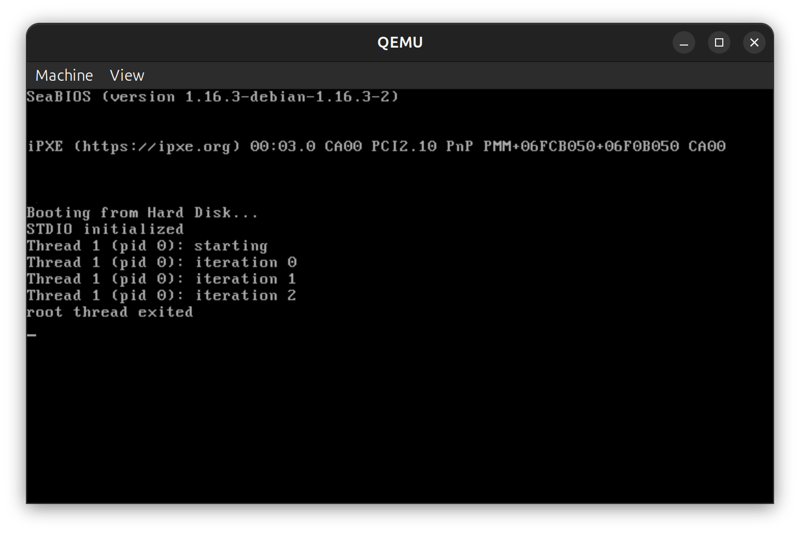
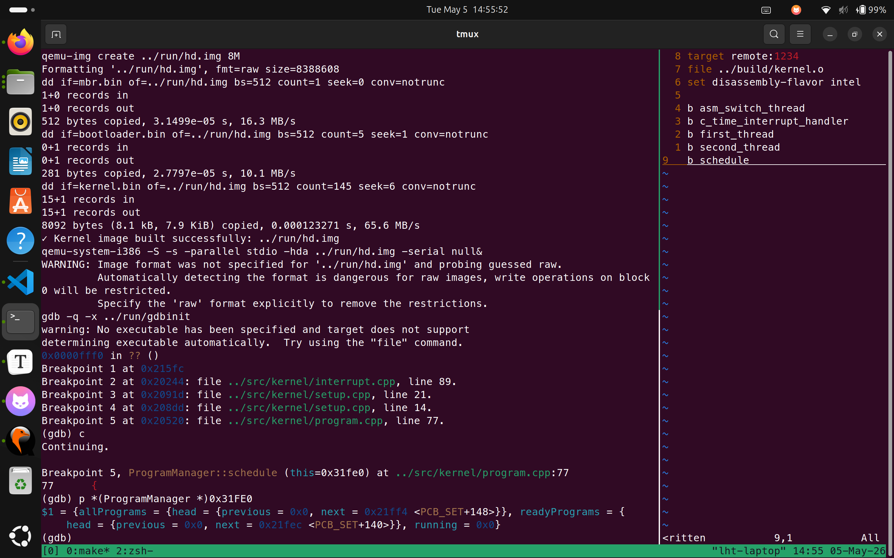
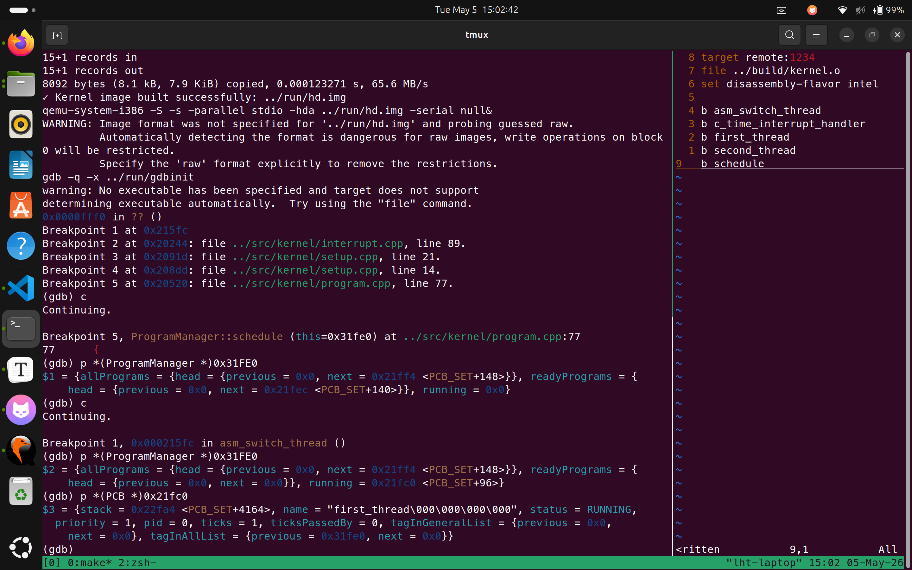
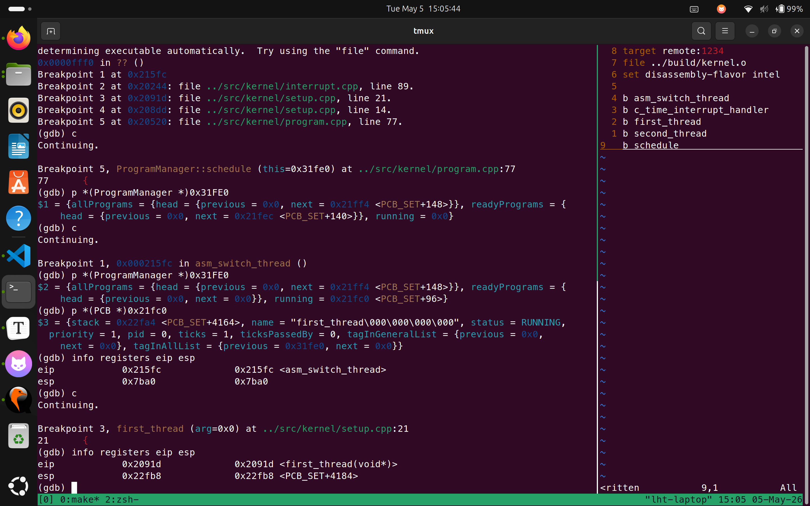
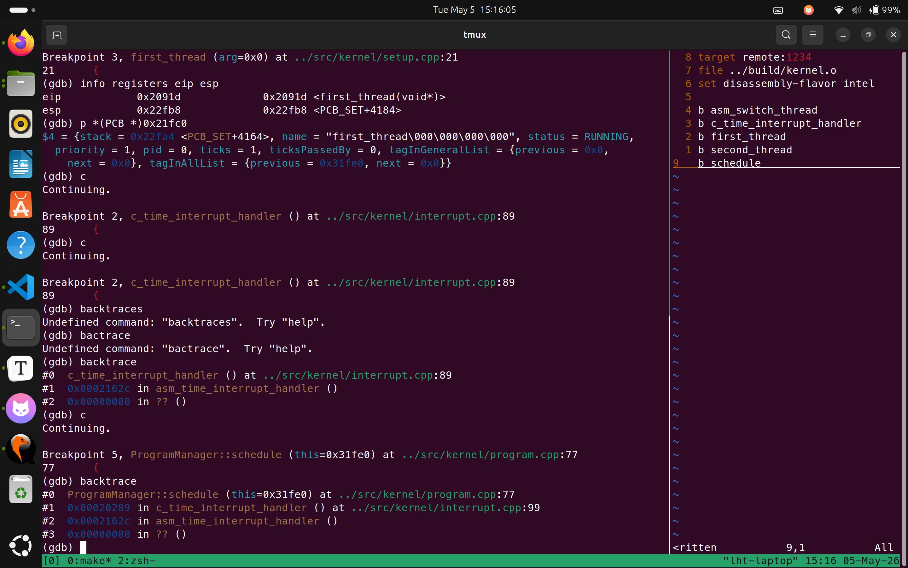
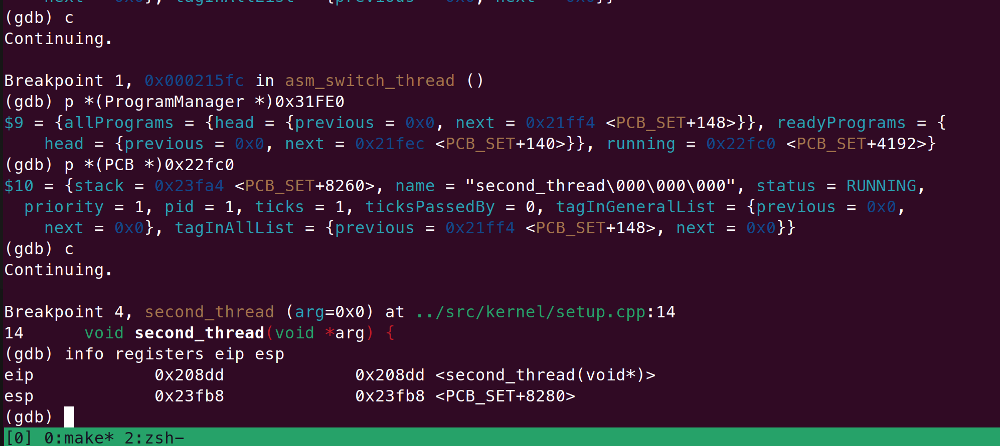
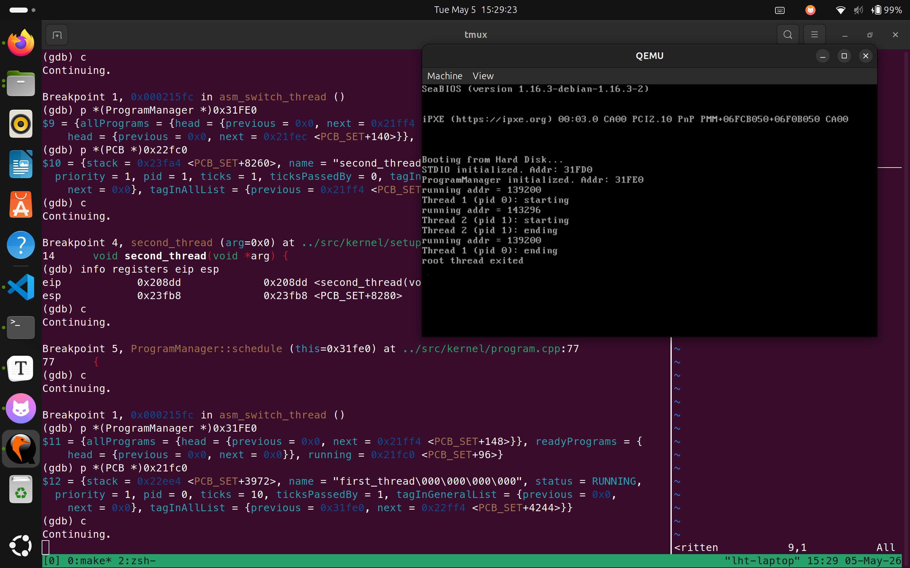
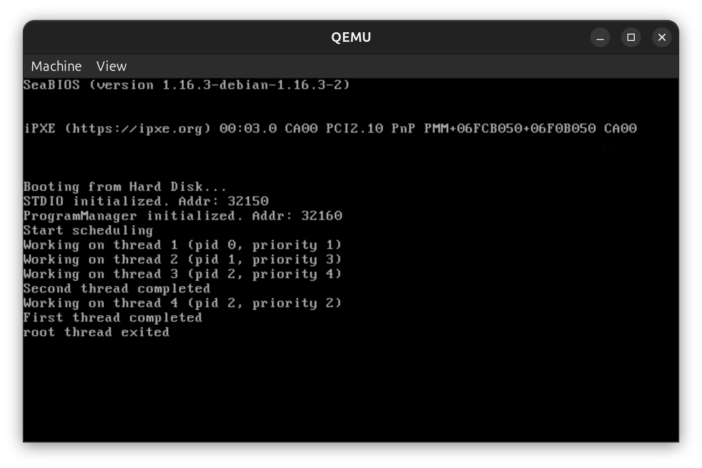

# 操作系统实验 Lab5 - 内核线程与进程调度

## 实验要求

- Assignment 1: printf 的实现
- Assignment 2: 内核线程的实现
- Assignment 3: 线程调度上下文切换的秘密
- Assignment 4: 调度算法的实现

---

## 实验过程

### Assignment 1：printf 的实现

printf 函数的实现需要：

1. 使用 `va_start` 初始化参数指针
2. 逐字符扫描格式字符串
3. 遇到 `%` 时，根据后续字符确定类型
4. 使用 `va_arg` 获取对应的参数
5. 将参数转换为字符串后输出

支持的格式说明符大部分和资料一样，本项作业新增了二进制和八进制的支持：

| 说明符 | 含义 | 处理方式 |
| --- | --- | --- |
| %% | 百分号 | 输出单个百分号 |
| %c | 单个字符 | 直接取第一个字符 |
| %s | 字符串 | 获取指针并逐字符输出 |
| %b | 二进制 | 将 int 转换为二进制字符串 |
| %o | 八进制 | 将 int 转换为八进制字符串 |
| %d | 十进制整数 | 将 int 转换为十进制字符串 |
| %x | 十六进制 | 将 int 转换为十六进制字符串 |

### Assignment 2：内核线程的实现

#### 2.1 PCB 结构设计

设计完整的 PCB (Process Control Block) 结构，包含：

- `stack` - 栈指针
- `name` - 线程名
- `status` - 线程状态 (CREATED, RUNNING, READY, BLOCKED, DEAD)
- `priority` - 优先级
- `pid` - 进程/线程 ID
- `ticks` - 时间片
- `ticksPassedBy` - 已执行时间

#### 2.2 线程创建过程

**线程创建流程：**

1. 分配 4KB PCB 空间
2. 初始化线程栈，设置返回地址和参数
3. 将线程加入就绪队列
4. 中断驱动的调度器会在适当时刻切换到新线程

### Assignment 3：线程调度上下文切换

**作业目标：**

Q：新创建的线程是如何被调度然后开始执行的？

查看 `ProgramManager::executeThread` 和 `ProgramManager::schedule` 可以发现，前者用来创建线程，后者用来调度线程。

前者先创建线程并将其加入就绪队列，后者从就绪队列中选择下一个要执行的线程。

Q：一个正在执行的线程是如何被中断然后被换下处理器的，以及换上处理器后又是如何从被中断点开始执行的。

查看代码可以知道，有如下关键函数及作用：

- `c_time_interrupt_handler()` [interrupt.cpp](src/kernel/interrupt.cpp#L88) - 时间中断处理程序
  - 递减当前线程的时间片计数
  - 时间片用尽时调用 `schedule()` 进行线程切换

- `asm_switch_thread(PCB *cur, PCB *next)` [src/utils/asm_utils.asm](src/utils/asm_utils.asm) - 汇编实现的线程切换
  - 保存当前线程的 ESP 到 PCB
  - 加载下一个线程的 ESP
  - 实现硬件级的上下文切换

**线程切换过程：**
1. **中断发生** - 时钟中断打断当前线程执行
2. **保存状态** - CPU 自动压栈 (CS, EIP, EFLAGS 等)
3. **进入中断处理** - 执行 `c_time_interrupt_handler()`
4. **调度决策** - 如果时间片用尽，调用 `schedule()`
5. **上下文切换** - `asm_switch_thread()` 交换栈指针和所有寄存器
6. **线程恢复** - 加载新线程的栈，`iret` 返回并继续执行


### Assignment 4：抢占式优先级调度算法的实现

这次作业考虑实现抢占式优先级调度算法。

需要考虑的点是，在创建线程时为其分配不同的优先级，并在调度时根据优先级选择下一个要执行的线程。

此外对于抢占式算法，如果当前线程执行时，遇到了一个优先级更高的线程，调度器会将其切换到该线程。

所以在 `executeThread` 添加线程时，需要增加一次抢占判断。因为 `executeThread` 创建线程时已经关中断了，可以安全地进行抢占判断。

**线程调度过程：**

1. **线程创建** - 调用 `executeThread` 创建新线程
2. **抢占判断** - 在创建线程时检查是否需要抢占
3. **加入就绪队列** - 将新线程加入就绪队列
4. **调度决策** - 调用 `schedulePriority` 选择下一个要执行的线程
5. **上下文切换** - 使用 `asm_switch_thread` 进行上下文切换

---

## 关键代码

### 1. Assignment 1：printf 的关键实现

由于 itos 函数已经实现了整数到 2\~26 进制字符串的转换，这里只需要根据不同情况调用不同的进制转换即可：

```cpp
int printf(const char *const fmt, ...) {
    // ...
    case 'b':
    case 'o':
    case 'd':
    case 'x':
        int temp = va_arg(ap, int);

        if (temp < 0 && fmt[i] == 'd') {
            counter += printf_add_to_buffer(buffer, '-', idx, BUF_LEN);
            temp = -temp;
        }

        itos(number, temp, (
            fmt[i] == 'd' ? 10 : (fmt[i] == 'o' ? 8 :
            (fmt[i] == 'x' ? 16 : 2))));

        for (int j = temp - 1; j >= 0; --j) {
            counter += printf_add_to_buffer(buffer, number[j], idx, BUF_LEN);
        }

        break;
    // ...
}
```

### 2. Assignment 2：线程创建的关键实现

**线程创建函数：**

```cpp
thread_t* thread_create(void (*entry)(void), uint32 stackSize) {
    thread_t *thread = thread_allocate();
    if (thread == NULL) return NULL;
    
    // 分配栈空间
    thread->stack = (uint32 *)malloc(stackSize);
    thread->stackSize = stackSize;
    thread->id = nextThreadId++;
    thread->state = READY;
    
    // 初始化栈和上下文
    uint32 *sp = thread->stack + (stackSize / sizeof(uint32)) - 1;
    *sp = (uint32)entry;  // 压入返回地址
    sp--;
    
    // 初始化寄存器
    thread->context.esp = (uint32)sp;
    thread->context.ebp = (uint32)sp;
    thread->context.eip = (uint32)entry;
    thread->context.eax = thread->context.ebx = 0;
    thread->context.ecx = thread->context.edx = 0;
    
    if (currentThread == NULL) {
        currentThread = thread;
    }
    
    printf("Thread %d created\n", thread->id);
    return thread;
}
```

### 3. Assignment 3：线程调度切换

这边是 Round Robin 的调度算法，每个线程分配了 `ticks = 1` 即长度为两次中断的时间片。

```cpp
void ProgramManager::schedule()
{
    bool status = interruptManager.getInterruptStatus();
    interruptManager.disableInterrupt();

    if (readyPrograms.size() == 0)
    {
        interruptManager.setInterruptStatus(status);
        return;
    }

    if (running != nullptr)
    {
        if (running->status == ProgramStatus::RUNNING)
        {
            running->status = ProgramStatus::READY;
            running->ticks = 1;
            readyPrograms.push_back(&(running->tagInGeneralList));
        }
        else if (running->status == ProgramStatus::DEAD)
        {
            releasePCB(running);
        }
    }

    ListItem *item = readyPrograms.front();
    PCB *next = ListItem2PCB(item, tagInGeneralList);
    PCB *cur = running;
    next->status = ProgramStatus::RUNNING;
    running = next;
    readyPrograms.pop_front();
    printf("running addr = %d\n", (int)running);

    asm_switch_thread(cur, next);

    interruptManager.setInterruptStatus(status);
}
```

### 4. Assignment 4：抢占式优先级调度算法

```cpp
void ProgramManager::schedulePriority()
{
    bool status = interruptManager.getInterruptStatus();
    interruptManager.disableInterrupt();

    if (readyPrograms.size() == 0)
    {
        interruptManager.setInterruptStatus(status);
        return;
    }

    if (running != nullptr)
    {
        if (running->status == ProgramStatus::RUNNING)
        {
            running->status = ProgramStatus::READY;
            readyPrograms.push_back(&(running->tagInGeneralList));
        }
        else if (running->status == ProgramStatus::DEAD)
        {
            releasePCB(running);
        }
    }

    // Find the highest priority thread (highest priority value)
    ListItem *item = readyPrograms.front();
    PCB *highest = ListItem2PCB(item, tagInGeneralList);
    ListItem *current = item->next;
    
    while (current != nullptr)
    {
        PCB *thread = ListItem2PCB(current, tagInGeneralList);
        if (thread->priority > highest->priority)
        {
            highest = thread;
            item = current;
        }
        current = current->next;
    }

    // Remove the selected thread from ready queue
    readyPrograms.erase(item);
    
    PCB *next = highest;
    PCB *cur = running;
    next->status = ProgramStatus::RUNNING;
    running = next;

    asm_switch_thread(cur, next);

    interruptManager.setInterruptStatus(status);
}
```

抢占式实现：

```cpp
int ProgramManager::executeThread(ThreadFunction function, void *parameter, const char *name, int priority)
{
    // 关中断，防止创建线程的过程被打断
    bool status = interruptManager.getInterruptStatus();
    interruptManager.disableInterrupt();

    // 分配一页作为PCB
    PCB *thread = allocatePCB();

    if (!thread)
        return -1;

    // 初始化分配的页
    memset(thread, 0, PCB_SIZE);

    for (int i = 0; i < MAX_PROGRAM_NAME && name[i]; ++i)
    {
        thread->name[i] = name[i];
    }

    thread->status = ProgramStatus::READY;
    thread->priority = priority;
    thread->ticks = 1;
    thread->ticksPassedBy = 0;
    thread->pid = ((int)thread - (int)PCB_SET) / PCB_SIZE;

    // 线程栈
    thread->stack = (int *)((int)thread + PCB_SIZE);
    thread->stack -= 7;
    thread->stack[0] = 0;
    thread->stack[1] = 0;
    thread->stack[2] = 0;
    thread->stack[3] = 0;
    thread->stack[4] = (int)function;
    thread->stack[5] = (int)program_exit;
    thread->stack[6] = (int)parameter;

    allPrograms.push_back(&(thread->tagInAllList));
    readyPrograms.push_back(&(thread->tagInGeneralList));

    // 恢复中断
    interruptManager.setInterruptStatus(status);

    if (running != nullptr && thread->priority > running->priority)
    {
        programManager.schedulePriority();
    }

    return thread->pid;
}
```

---

## 实验结果

### Assignment 1 结果

```cpp
printf("print percentage: %%\n"
           "print char \"N\": %c\n"
           "print string \"Hello World!\": %s\n"
           "print binary: \"0b101010\": %b\n"
           "print octal: \"0o777\": %o\n"
           "print decimal: \"-1234\": %d\n"
           "print hexadecimal \"0x7abcdef0\": %x\n",
           'N', "Hello World!", 0b101010, 0777, -1234, 0x7abcdef0);
```

**程序输出：**


### Assignment 2 结果

程序入口设置：

```cpp
// 创建第一个线程
// ...
interruptManager.enableInterrupt();
programManager.schedule();
```

```cpp
void first_thread(void *arg) {
    printf("Thread 1 (pid %d): starting\n", programManager.running->pid);
    for(int i = 0; i < 3; i++) {
        printf("Thread 1 (pid %d): iteration %d\n", 
        programManager.running->pid, i);
    }
    program_exit();
}
```

**线程创建验证：**



### Assignment 3 结果

**切换验证：**

首先是程序的执行结构：

```cpp
void second_thread(void *arg) {
    printf("Thread 2 (pid %d): starting\n", programManager.running->pid);
    printf("Thread 2 (pid %d): ending\n", programManager.running->pid);
    program_exit();
}

void first_thread(void *arg) {
    printf("Thread 1 (pid %d): starting\n", programManager.running->pid);
    programManager.executeThread(second_thread, nullptr, "second_thread", 1);
    while (programManager.readyPrograms.size() > 0);
    printf("Thread 1 (pid %d): ending\n", programManager.running->pid);
    program_exit();
}

extern "C" void setup_kernel() {   
    // ...
    int pid = programManager.executeThread(
        first_thread, nullptr, "first_thread", 1);
    // ...
    programManager.schedule();
    // ...
}
```

在 GDB 环境下，先进入 `setup_kernel`，然后由 `schedule` 函数进行第一次调度，将 `first_thread` 放入 ready 队列，效果如下：



在进入 `asm_switch_thread` 之前，可以看到 `programManager.running` 被正确切换到 `first_thread` 的 PCB 地址，我们也可以打印出这个 PCB 的内容，如下：



随后我们进入 `first_thread`。查看进入进程前和进入进程后的 esp, 可以发现 esp 正好和栈指针相差 20, 即 `asm_switch_thread` 函数中 `pop` 和 `ret` 操作前移了 20 字节，正是上下文切换的结果。寄存器值如下：



从代码里可以看出，第一个线程在创建完第二个线程后，会被 while 语句阻塞。随后会自动触发两次时间中断，耗尽时间片，由 `intteruptManager` 调用 schedule 强制调度：



随后，schedule 根据 Round Robin 规则，调度执行 `second_thread`，可以进入程序片段后检查寄存器 esp, 确实是栈指针 +20 的结果：



我们执行完 `second_thread`，可以看到算法接下来需要调度下一个执行的进程，即 `first_thread`，并且从上一次的中断点执行。实现上 `asm_switch_thread(cur, next)` 这个函数先把当前上一次被中断的 `first_thread` 的 esp 存进 PCB 的 `stack`，下一次调度时再从中恢复。可以看到 `first_thread` 的 PCB 和恢复执行的结果如下：



### Assignment 4 结果

**线程优先级设置**

```cpp
// setup_kernel()
programManager.executeThread(first_thread, nullptr, "first_thread", 1);
    
interruptManager.enableInterrupt();
while (programManager.readyPrograms.size() > 0)
{
  printf("Start scheduling\n");
  programManager.schedulePriority();
}
```

```cpp
void third_thread(void *arg) {
    printf("Working on thread 3 (pid %d, priority %d)\n", programManager.running->pid, programManager.running->priority);
    program_exit();
}
void forth_thread(void *arg) {
    printf("Working on thread 4 (pid %d, priority %d)\n", programManager.running->pid, programManager.running->priority);
    program_exit();
}

void second_thread(void *arg) {
    printf("Working on thread 2 (pid %d, priority %d)\n", programManager.running->pid, programManager.running->priority);
    programManager.executeThread(third_thread, nullptr, "third_thread", 4);
    programManager.executeThread(forth_thread, nullptr, "forth_thread", 2);
    printf("Second thread completed\n");
    program_exit();
}

void first_thread(void *arg)
{
    printf("Working on thread 1 (pid %d, priority %d)\n", programManager.running->pid, programManager.running->priority);
    programManager.executeThread(second_thread, nullptr, "second_thread", 3);
    printf("First thread completed\n");
    program_exit();
}
```

**调度顺序验证：**

线程 2 抢占线程 1；线程 2 创建了线程 3 和 4, 其中线程 3 可以抢占线程 2, 线程 4 优先级低于线程 2, 只能在线程 2 执行完成后执行；线程 1 优先级最低，最后执行完毕。



---

## 总结

本实验完成了从基础的格式化输出函数实现，到内核线程创建、上下文切换，再到调度算法实现的完整链路。通过这次实验，我对内核中“线程如何被创建、如何被切换、如何被调度”有了更完整的理解。

### 1. 理论收获

- **可变参数机制**：深入理解了 `printf` 中 `va_list`、`va_start` 和 `va_arg` 的使用方式，也进一步理解了函数调用时参数在栈中的传递过程。
- **线程模型**：理解了 PCB/TCB 在操作系统中的作用，每个线程都需要保存自己的栈、状态、优先级和运行信息。
- **上下文切换**：认识到线程切换的核心不是简单跳转，而是保存当前现场、恢复目标线程现场，并通过 `iret` 返回到被中断的位置继续执行。
- **调度算法**：了解了先来先服务、轮转调度以及抢占式优先级调度的基本思想和适用场景。

### 2. 技术收获

- 实现了支持多种格式说明符的 `printf`，为内核调试提供了方便。
- 设计并实现了 PCB 结构、线程创建流程和就绪队列管理机制。
- 建立了基于汇编的上下文切换框架，明确了 `asm_switch_thread` 在保存和恢复栈指针中的作用。
- 实现了轮转调度和优先级调度，并理解了中断驱动调度在内核中的工作方式。

### 3. 问题解决

- **可变参数处理**：通过分析栈帧布局，正确处理了不同类型参数的读取和输出。
- **线程栈初始化**：根据线程首次启动和函数返回的需要，手工构造了初始栈帧。
- **上下文恢复**：通过 GDB 调试确认了线程切换时 `esp`、PCB 中保存的 `stack` 以及中断返回之间的对应关系。
- **抢占式调度**：在创建线程和时钟中断两个位置加入调度判断，解决了高优先级线程不能及时抢占的问题。