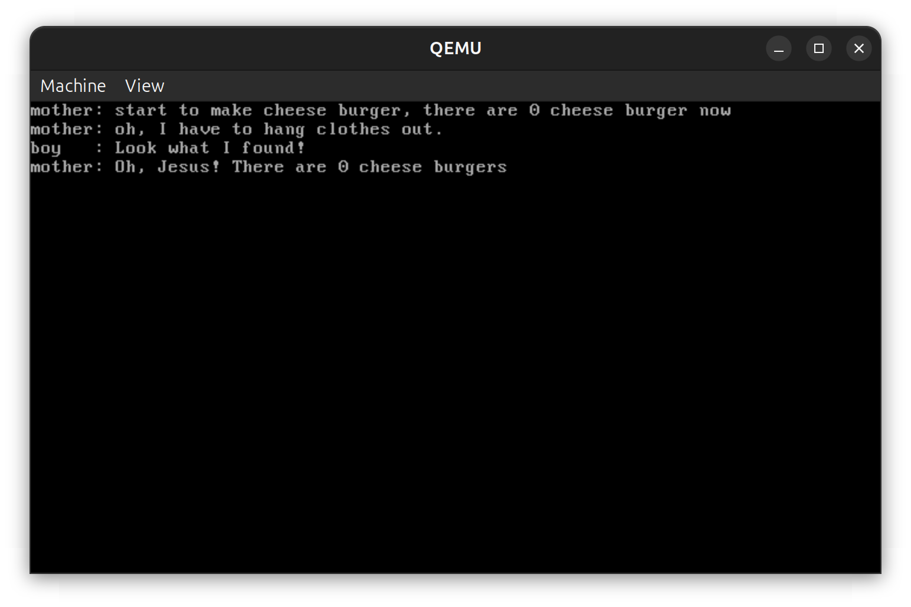
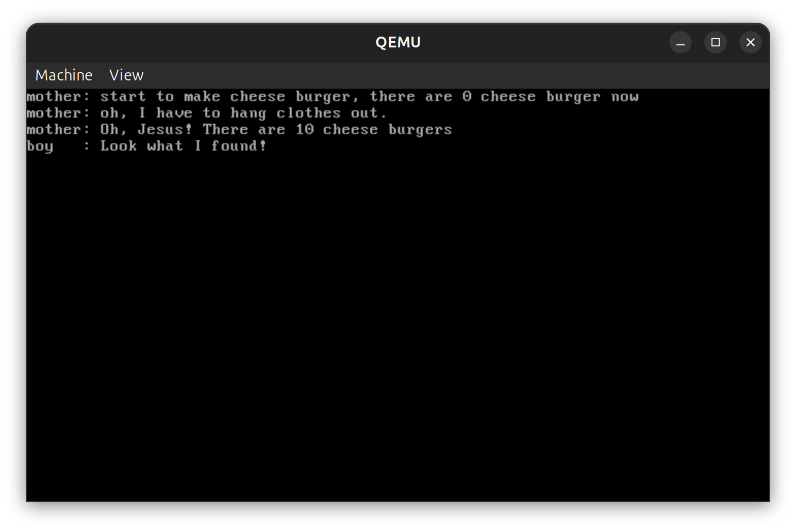
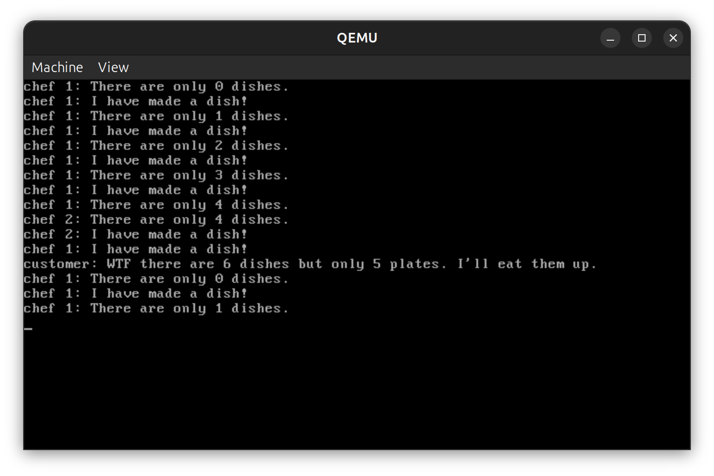
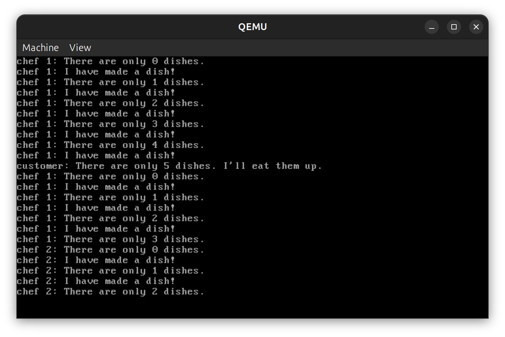
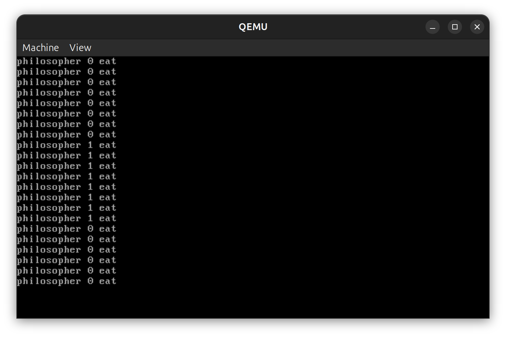
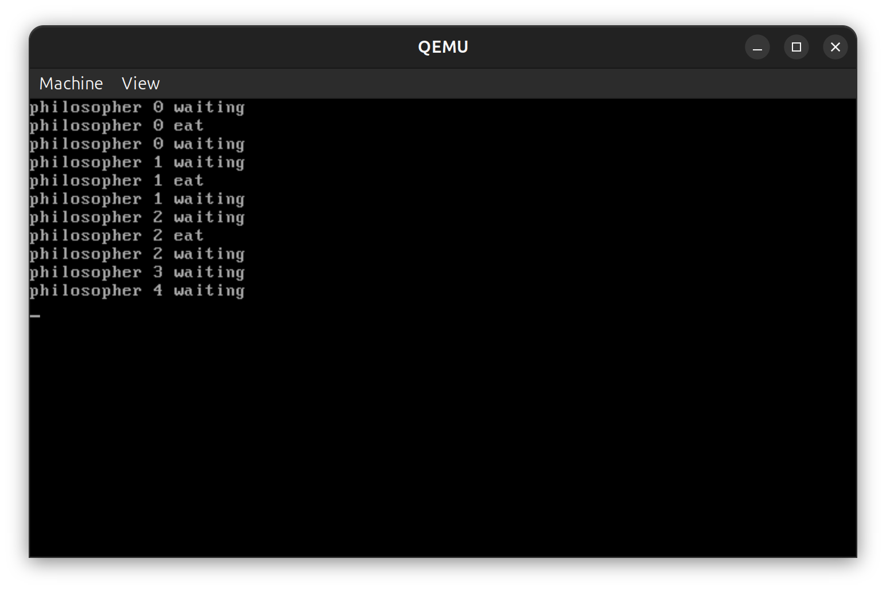
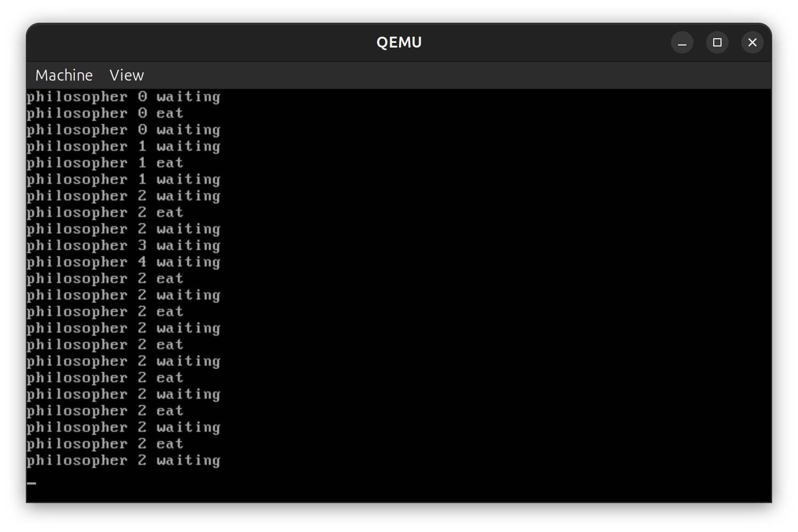

# 操作系统实验 Lab6 - 并发与锁机制

## 实验要求

- Assignment 1：代码复现  
  - A.1.1 代码复现  
  - A.1.2 锁机制的实现
- Assignment 2：生产者-消费者问题  
  - A.2.1 Race Condition  
  - A.2.2 信号量解决方法
- Assignment 3：线程调度切换的秘密  
  - A.3.1 初步解决方法  
  - A.3.2 死锁解决方法

---

## 实验过程

### Assignment 1：代码复现

#### A.1.1 代码复现

直接复用了材料中的 `src/1`，在 `first_thread` 中创建 `a_mother` 和 `a_naughty_boy` 两个线程。  
共享变量是 `cheese_burger`，母亲线程先 `+10`，儿子线程再 `-10`，且母亲中间有延迟，触发调度切换。

复现实验后可以观察到竞态条件，即母亲最后读到的汉堡数为 0。

为了解决这个问题，分别采用自旋锁和信号量两种机制。

自旋锁使用材料目录 `src/2` 的代码，信号量使用材料目录 `src/3` 的代码。结果都能正确地保证互斥，母亲最后读到的汉堡数为 10。

#### A.1.2 锁机制的实现

使用自旋锁 `SpinLock` 保护临界区，把原教程里的 `xchg` 方案改为 `lock bts` 方案。  

```asm
lock bts dword [ebx], 0
```

这条指令可以将 `ebx` 指向的内存地址的第 0 位设置为 1，并返回原值。若原值为 0，说明成功获得锁；若原值为 1，说明锁已被占用，需要继续自旋。并且由于 `lock` 前缀，这条指令是原子的，保证了互斥性。

加锁后共享变量访问具备互斥性，竞态条件被消除。

---

### Assignment 2：生产者-消费者问题

#### A.2.1 Race Condition

考虑如下的生产者-消费者问题：有两个厨师和一个顾客，厨师负责做菜，顾客负责吃菜。

两个厨师会检测当前菜的数量，如果少于最大值就做菜；顾客会步行前来餐厅，如果发现有菜就吃掉，如果发现菜的数量大于最大值会发出警告。由于两个厨师同时访问共享变量 `dish` 并且在 `dish < MAX_DISHES` 条件下进行修改，存在竞态条件，可能导致 `dish` 的值不正确，顾客可能吃到过多的菜。

#### A.2.2 信号量解决方法

使用两个信号量用来表示空盘和满盘（即 `MAX_DISHES - dish` 和 `dish`）即可。把原来 `dish < MAX_DISHES` 的条件判断改为 `empty.P()`，每次做菜后 `full.V()`；顾客吃菜前 `full.P()`，吃完后 `empty.V()`。这样就能保证生产者和消费者之间的同步，避免竞态条件。

---

### Assignment 3：线程调度切换的秘密

#### A.3.1 初步解决方法

定义五个信号量，表示每个筷子的状态（0 表示被占用，1 表示空闲）。每个哲学家在吃饭前先申请左边的筷子，再申请右边的筷子，吃完后释放两个筷子。这样就能保证互斥访问筷子。

#### A.3.2 死锁解决方法

为了解决死锁，注意到可以规定最多只有四个哲学家同时尝试拿筷子，这样至少会有一个哲学家能够成功拿到两只筷子并吃饭，从而释放筷子给其他人使用。即使用一个额外的信号量 `room` 来限制同时尝试拿筷子的哲学家数量。

---

## 关键代码

### Assignment 1（A.1.1）：无锁版本

```cpp
int cheese_burger;

void a_mother(void *arg)
{
    int delay = 0;
    printf("mother: start to make cheese burger, there are %d cheese burger now\n", cheese_burger);
    cheese_burger += 10;
    printf("mother: oh, I have to hang clothes out.\n");
    delay = 0xfffffff;
    while (delay) --delay;
    printf("mother: Oh, Jesus! There are %d cheese burgers\n", cheese_burger);
}

void a_naughty_boy(void *arg)
{
    printf("boy   : Look what I found!\n");
    cheese_burger -= 10;
}
```

### Assignment 1（A.1.2）：自旋锁版本

```cpp
void SpinLock::lock()
{
    while (asm_lock_bts(&bolt))
    {
    }
}

void SpinLock::unlock()
{
    bolt = 0;
}
```

```asm
; uint32 asm_lock_bts(uint32 *memory)
asm_lock_bts:
    mov ebx, [esp + 4]
    lock bts dword [ebx], 0
    setc al
    movzx eax, al
    ret
```

```cpp
SpinLock aLock;

void a_mother(void *arg)
{
    aLock.lock();
    // 临界区
    cheese_burger += 10;
    // ...
    aLock.unlock();
}
```

### Assignment 1（A.1.2）：信号量版本

```cpp
void Semaphore::P()
{
    PCB *cur = nullptr;
    while (true)
    {
        semLock.lock();
        if (counter > 0)
        {
            --counter;
            semLock.unlock();
            return;
        }
        cur = programManager.running;
        waiting.push_back(&(cur->tagInGeneralList));
        cur->status = ProgramStatus::BLOCKED;
        semLock.unlock();
        programManager.schedule();
    }
}
```

```cpp
void Semaphore::V()
{
    semLock.lock();
    ++counter;
    if (waiting.size())
    {
        PCB *program = ListItem2PCB(waiting.front(), tagInGeneralList);
        waiting.pop_front();
        semLock.unlock();
        programManager.MESA_WakeUp(program);
    }
    else
    {
        semLock.unlock();
    }
}
```

### Assignment 2：生产者-消费者问题（A.2.1）

```cpp
void chef_1(void *arg) {
    while (1) {
        if (dish < MAX_DISHES) {
            printf("chef 1: There are only %d dishes.\n", dish);
            mysleep(DELAY); // making a dish
            ++dish;
            printf("chef 1: I have made a dish!\n");
        }
    }
}
void chef_2(void *arg) {
    while (1) {
        if (dish < MAX_DISHES) {
            printf("chef 2: There are only %d dishes.\n", dish);
            mysleep(DELAY); // making a dish
            ++dish;
            printf("chef 2: I have made a dish!\n");
        }
    }
}

void a_customer(void *arg) {
    mysleep(10 * DELAY); // coming to the restaurant
    if (dish > MAX_DISHES) {
        printf("customer: WTF there are %d dishes but only %d plates. I'll eat them up.\n", dish, MAX_DISHES);
    } else {
        printf("customer: There are only %d dishes. I'll eat them up.\n", dish);
    }
    dish = 0;
}
```

### Assignment 2：使用信号量解决问题（A.2.2）

```cpp
void chef_1(void *arg) {
    while (1) {
        empty.P();
        printf("chef 1: There are only %d dishes.\n", dish);
        mysleep(DELAY); // making a dish
        ++dish;
        full.V();
        printf("chef 1: I have made a dish!\n");
    }
}
void chef_2(void *arg) {
    while (1) {
        empty.P();
        printf("chef 2: There are only %d dishes.\n", dish);
        mysleep(DELAY); // making a dish
        ++dish;
        full.V();
        printf("chef 2: I have made a dish!\n");
    }
}

void a_customer(void *arg) {
    mysleep(10 * DELAY); // coming to the restaurant
    if (dish > MAX_DISHES) {
        printf("customer: WTF there are %d dishes but only %d plates. I'll eat them up.\n", dish, MAX_DISHES);
    } else {
        printf("customer: There are only %d dishes. I'll eat them up.\n", dish);
    }
    while (1) {
        full.P();
        --dish;
        empty.V();
    }
}
```

### Assignment 3：哲学家进餐问题（A.3.1）

```cpp
Semaphore chopsticks[N];
// ...
void philosopher(void *arg) {
    int who_am_i = (int)arg;
    while (true) {
        THINK();
        chopsticks[LEFT].P();
        chopsticks[RIGHT].P();
        EAT();
        printf("philosopher %d eat\n", who_am_i);
        chopsticks[LEFT].V();
        chopsticks[RIGHT].V();
    }
}

void first_thread(void *arg) {
    // ...
    for (int i = 0; i < N; ++i) {
        chopsticks[i].initialize(1);
        programManager.executeThread(philosopher, (void *)i, "philosopher", 1);
    }
    // ...
}
```

### Assignment 3：哲学家进餐问题死锁解决（A.3.2）

如果在拿起左筷子和右筷子间发生调度切换，可能导致死锁。人为添加一个较长的延迟可以更容易地观察到死锁现象。

```cpp
chopsticks[LEFT].P();
mysleep(DELAY * 10);
chopsticks[RIGHT].P();
```

为了解决死锁问题，引入一个额外的信号量 `room` 来限制同时尝试拿筷子的哲学家数量：

```cpp
Semaphore chopsticks[N], room;

void philosopher(void *arg) {
    int who_am_i = (int)arg;
    while (true) {
        THINK();
        room.P();
        chopsticks[LEFT].P();
        mysleep(DELAY * 10);
        chopsticks[RIGHT].P();
        EAT();
        printf("philosopher %d eat\n", who_am_i);
        chopsticks[LEFT].V();
        chopsticks[RIGHT].V();
        room.V();
    }
}

void first_thread(void *arg) {
    // ...
    room.initialize(N - 1);
    for (int i = 0; i < N; ++i) {
        chopsticks[i].initialize(1);
        programManager.executeThread(philosopher, (void *)i, "philosopher", 1);
    }
    // ...
}
```

---

## 实验结果

### Assignment 1 结果

无锁：复现 race condition，母亲末次读取结果不可靠。  



使用自旋锁或者信号量后，结果稳定，互斥生效。  



### Assignment 2 结果

Race condition：厨师可能同时检测到菜的数量不足，导致过量生产，顾客吃到过多的菜。效果如下图：



加上信号量后，生产者和消费者之间的同步得到保证，菜的数量始终在合理范围内。效果如下图：



### Assignment 3 结果

默认情况下，可以看到多线程模拟哲学家就餐，效果如下：



添加延迟后，更容易观察到死锁现象，效果如下图：



可以看到五个哲学家都在等待筷子，形成死锁。

为了解决这个问题，引入 `room` 信号量后，死锁现象被消除，哲学家能够正常就餐。效果如下图：



---

## 总结

本次实验的核心收获有三点：

1. **理解了竞态条件的本质**：共享变量并发访问必须有同步约束。  
2. **掌握了两类同步机制**：自旋锁适合短临界区，信号量适合需要阻塞唤醒的场景。  
3. **明确了调度与死锁的关系**：线程切换是上下文管理问题，死锁是资源分配策略问题。

整体上，Assignment 1~3 的问题都可以归结为“并发下如何正确地约束执行顺序和资源访问”。