## 实验要求

实验八的内容为"从内核态到用户态"，共包含三个 Assignment：

**Assignment 1：系统调用** — 编写一个系统调用（如 `write` 系统调用，实现从用户态向屏幕输出字符串），在进程中调用之，并使用 gdb 分析系统调用执行过程中的栈变化情况，说明 TSS 在系统调用执行过程中的作用。

**Assignment 2：Fork 的奥秘** — 实现 `fork` 函数，分析 fork 实现的基本思路。从子进程第一次被调度执行时开始，用 gdb 逐步跟踪子进程的执行流程一直到子进程从 fork 返回，分析跳转地址、数据寄存器和段寄存器的变化，并比较与父进程返回过程的异同。解释 fork 如何保证子进程返回值为 0、父进程返回值为子进程 pid。

**Assignment 3：哼哈二将 wait & exit** — 实现 `wait` 和 `exit` 函数，分析 exit 的执行过程以及进程退出后隐式调用 exit 且返回值为 0 的原因。分析 wait 的执行过程。对孤儿进程和僵尸进程的处理提出并实现解决方案。

---

## 实验过程

### Assignment 1：自定义系统调用 factorial 的实现与分析

#### 实现思路

本 Assignment 实现了两个自定义系统调用：`factorial(n)` 计算阶乘（系统调用号 = 6），以及辅助调试用的 `get_pid()` 返回当前进程 PID（系统调用号 = 7）。

**用户侧包装函数**（`syscall.cpp`）：

```cpp
int factorial(int n) {
    return asm_system_call(6, n);   // 系统调用号=6
}

int get_pid() {
    return asm_system_call(7);      // 系统调用号=7
}
```

**内核侧处理函数**：

```cpp
int syscall_factorial(int n) {
    if (n <= 1) return 1;
    int result = 1;
    for (int i = 2; i <= n; ++i) result *= i;
    return result;
}

int syscall_get_pid() {
    return programManager.running->pid;
}
```

**注册系统调用**（`setup_kernel`）：

```cpp
systemService.setSystemCall(6, (int)syscall_factorial);
systemService.setSystemCall(7, (int)syscall_get_pid);
```

**测试函数** `a1_process`：

```cpp
void a1_process() {
    int pid = get_pid();
    printf("my pid: %d\n", pid);
    int n = 5;
    int result = factorial(n);
    printf("factorial(%d) = %d\n", n, result);
    for (int i = 0; i <= 8; ++i) {
        printf("factorial(%d) = %d\n", i, factorial(i));
    }
    asm_halt();
}
```

#### gdb 分析系统调用的栈变化

使用条件断点 `b asm_system_call if ($cs & 3) == 3` 仅捕获用户态（CPL=3）发起的系统调用，排除内核线程（如 `first_thread` 中 `printf` 触发的 write 调用）的干扰。以下以用户进程中 `printf` 内部触发的 write 系统调用（系统调用号=1）为例，分析从用户态进入内核态的完整栈变化。

**1. 系统调用入口 —— `asm_system_call`（用户态）**

```
CS = 0x2b  (RPL=3，用户代码段)
ESP = 0x8048f14  (用户栈，在 USER_VADDR_START 以上)
```

此时 CSP=3，尚在用户态。栈顶为用户函数的返回地址 `0xc0022934`，接着依次为系统调用参数（系统调用号=1，参数字符串指针=0x08048f7f）。

**2. 执行 `int 0x80` 之前**

```
CS = 0x2b  (用户态)
ESP = 0x8048efc  (用户栈向下增长，经过 push ebp/ebx/ecx/edx/esi/edi)
```

`asm_system_call` 将 6 个参数通过寄存器传递（系统调用号→eax，参数 1~5→ebx/ecx/edx/esi/edi），然后执行 `int 0x80`。

**3. 执行 `int 0x80` 之后 —— `asm_system_call_handler`（内核态）**

```
CS = 0x20  (RPL=0，内核代码段)
ESP = 0xc002678c  (内核栈，位于进程 PCB 页面内)
```

CPU 从 TSS 中读取 `ss0` 和 `esp0`，切换到 0 特权级栈。栈上 CPU 自动压入了 **5 个值**（由于发生了特权级转移 CPL=3→0）：

```
0xc002678c: 0xc00233cf   ← EIP（int 0x80 后的返回地址）
0xc0026790: 0x0000002b   ← 旧的 CS = 0x2b（用户代码段，CPL=3）
0xc0026794: 0x00000206   ← EFLAGS
0xc0026798: 0x08048efc   ← 旧的 ESP（用户栈指针）
0xc002679c: 0x0000003b   ← 旧的 SS = 0x3b（用户栈段，RPL=3）
```

栈上 5 个值（而非内核态调用时的 3 个值）是**特权级转移的明确证据**——只有 CPL 发生改变时，CPU 才会额外压入 SS 和 ESP。紧接着 `asm_system_call_handler` 依次压入 ds、es、fs、gs 和 pushad 的 8 个通用寄存器，完成现场保护。

**4. 系统调用返回**

```
CS = 0x2b  (恢复为用户代码段，CPL=3)
ESP = 0x8048f94  (恢复为用户栈)
EAX = 0x78 = 120  (factorial(5) 的返回值)
```

`iret` 指令弹出 CS:EIP:EFLAGS:ESP:SS，CPU 从内核态返回用户态，继续执行 `asm_system_call` 中 `int 0x80` 之后的指令，最终将系统调用返回值通过 `eax` 传递给调用者。

#### TSS 在系统调用中的作用

当 CPU 执行 `int 0x80` 从用户态（CPL=3）进入内核态（CPL=0）时，CPU 自动从 TR 寄存器指向的 TSS 中读取 `ss0` 和 `esp0` 字段，将其加载到 SS 和 ESP 中，完成栈切换。TSS 在系统调用中的关键作用：

- **提供 0 特权级栈地址**：`ss0 = 0x10`（STACK_SELECTOR），`esp0` 在进程调度时由 `activateProgramPage` 设置为 `(int)program + PAGE_SIZE`（即进程 PCB 所在页的顶部）。
- **隔离用户栈与内核栈**：中断发生前的用户态寄存器上下文（SS、ESP、EFLAGS、CS、EIP）被保存在内核栈上，而非不可信的用户栈，保证了内核代码的安全性。
- **支持 iret 恢复**：通过 `iret` 时从内核栈上弹出用户态 SS、ESP、EFLAGS、CS、EIP，正确恢复到用户态继续执行。

### Assignment 2：Fork 的奥秘

#### 实现思路

fork 是一个系统调用，用于创建当前进程的完整副本（子进程）。其实现围绕四个核心问题：

1. **代码段共享**：父子进程的 3GB~4GB 虚拟地址空间都映射到相同的内核代码，因此代码天然共享。
2. **从相同返回点执行**：fork 从系统调用返回，子进程通过复制父进程的 0 特权级栈内容（`ProcessStartStack`），使得 `iret` 后的 EIP 与父进程相同，实现从 fork 返回点继续执行。
3. **资源的复制**：进程资源包括 0 特权级栈、PCB、虚拟地址池位图、页目录表、页表及其指向的物理页。
4. **跨地址空间复制**：由于分页机制隔离，父进程无法直接写子进程地址空间。借助内核空间的中转页实现：父进程空间 → 中转页 → 切换到子进程空间 → 中转页 → 子进程空间。

实现流程（`ProgramManager::fork`）：

```
fork() → asm_system_call(2) → int 0x80 → syscall_fork()
    → ProgramManager::fork()
        → executeProcess() 创建子进程PCB
        → copyProcess() 复制父进程资源到子进程
            ├─ 复制0特权级栈(ProcessStartStack)
            ├─ 设置子进程eax=0（确保返回值为0）
            ├─ 设置子进程stack指向asm_start_process
            ├─ 复制虚拟地址池位图
            ├─ 复制页目录表（分配新页表）
            ├─ 复制页表和物理页（使用中转页）
            └─ 归还中转页
        → 返回子进程pid
```

#### gdb 跟踪子进程执行流程

子进程被首次调度执行时：

1. `asm_switch_thread` 切换栈指针到子进程的 `stack`，弹出 ebp、ebx、edi、esi 后 `ret` 跳转到 `asm_start_process`。
2. `asm_start_process` 将 esp 设置为 `ProcessStartStack` 的地址，执行 `popad` → `pop gs/fs/es/ds` → `iret`。
3. `iret` 弹出 CS（用户代码段选择子，RPL=3）、EIP（= 父进程中 `int 0x80` 后的返回地址）、EFLAGS、ESP（用户栈）、SS（用户栈段）。
4. 子进程从与父进程相同的 EIP 处开始执行，回到 `asm_system_call` 中 `int 0x80` 的下一条指令。
5. 子进程依次恢复 edi、esi、edx、ecx、ebx、ebp，然后从 `asm_system_call` 返回，最终从 `fork()` 返回。

**父进程返回过程**：父进程执行完 `ProgramManager::fork` → `syscall_fork` → `asm_system_call_handler` → `popad` → `iret` → 回到 `asm_system_call` 中 `int 0x80` 后 → 逐层返回到 `fork()`。

**异同比较**：
- 相同：都通过相同的 `iret` 返回点（EIP 相同）
- 不同：子进程经过 `asm_start_process` 启动（多了一次上下文恢复）；父进程直接从 fork 系统调用返回。子进程的段寄存器（DS、ES、FS、GS）被设为用户数据段选择子；父进程保持在系统调用处理函数中设置的内核段。

#### Fork 返回值的奥秘

核心在于 `copyProcess` 中的：

```cpp
// 复制父进程0特权级栈到子进程
ProcessStartStack *childpps = ...;
ProcessStartStack *parentpps = ...;
memcpy(parentpps, childpps, sizeof(ProcessStartStack));
// 子进程的eax被设为0
childpps->eax = 0;
```

- 在 `asm_system_call_handler` 中，`popad` 从栈中恢复 eax，同时 `mov eax, [ASM_TEMP]` 将系统调用处理函数的返回值放入 eax。
- 对于**父进程**：`syscall_fork` → `ProgramManager::fork` 返回子进程 pid，该值通过 `mov [ASM_TEMP], eax` 保存，`popad` 后通过 `mov eax, [ASM_TEMP]` 恢复，故父进程中 `fork()` 返回子进程 pid。
- 对于**子进程**：在 `asm_start_process` 中执行 `popad` 时，eax 从 `ProcessStartStack.eax`（被设为 0）恢复，故子进程中 `fork()` 返回 0。

### Assignment 3：哼哈二将 wait & exit

#### exit 的执行过程

exit 系统调用允许进程主动退出，其执行流程分为三步：

1. **标记 PCB 状态为 DEAD 并保存返回值**：`program->retValue = ret; program->status = ProgramStatus::DEAD;`

2. **释放进程资源**（仅进程，线程跳过此步）：
   - 遍历用户空间（第 0~767 个页目录项），逐页表释放物理页
   - 释放页表占据的物理页
   - 释放页目录表占据的物理页
   - 释放虚拟地址池位图占据的物理页

3. **立即调度**：调用 `schedule()` 让出 CPU。

**进程隐式调用 exit 的机制**：在 `load_process` 中，用户进程的 3 特权级栈顶部被放入 `exit` 地址：

```cpp
int *userStack = (int *)interruptStack->esp;
userStack -= 3;
userStack[0] = (int)exit;   // 返回地址设为exit
userStack[1] = 0;           // exit的"返回地址"
userStack[2] = 0;           // exit的参数(ret=0)
interruptStack->esp = (int)userStack;
```

当进程的主函数执行完毕后，CPU 从栈中弹出"返回地址"（即 `exit` 的函数地址）并跳转执行，从而隐式调用 `exit(0)`。这就是进程退出后能够隐式调用 exit 且返回值为 0 的原因。

#### wait 的执行过程

wait 系统调用允许父进程等待并回收已结束的子进程：

1. **在 allPrograms 中查找 DEAD 状态的子进程**：通过 `child->parentPid == this->running->pid` 确认父子关系。

2. **若找到 DEAD 子进程**：取出子进程返回值（通过 `retval` 指针传出），从 allPrograms 链表中移除子进程 PCB，返回子进程 pid。

3. **若存在子进程但非 DEAD**（即子进程还在运行）：调用 `schedule()` 让出 CPU，父进程被阻塞直到有子进程退出。

4. **若不存在任何子进程**（`flag == true`）：返回 -1。

核心代码逻辑：

```cpp
int ProgramManager::wait(int *retval)
{
    while (true) {
        // 遍历 allPrograms 查找 DEAD 子进程
        item = this->allPrograms.head.next;
        flag = true;  // 假设没有子进程
        while (item) {
            child = ListItem2PCB(item, tagInAllList);
            if (child->parentPid == this->running->pid) {
                flag = false;  // 存在子进程
                if (child->status == ProgramStatus::DEAD) {
                    break;  // 找到可回收的子进程
                }
            }
            item = item->next;
        }
        if (item) {
            // 回收子进程
            if (retval) *retval = child->retValue;
            int pid = child->pid;
            this->allPrograms.erase(&(child->tagInAllList));
            return pid;
        } else if (flag) {
            return -1;  // 无子进程
        } else {
            schedule();  // 有子进程但未退出，等待
        }
    }
}
```

schedule 中也会回收 DEAD 状态的线程 PCB（因为线程没有父线程来回收），但 DEAD 的进程 PCB 保留给父进程的 wait 来回收。

#### 孤儿进程与僵尸进程的处理

**解决方案——实现 init 进程回收机制**：

修改 `ProgramManager::exit` 和相关的 PCB 管理，使孤儿进程被"收养"给一个特殊的 init 进程（pid=0 的第一个进程或专门的回收进程）。在 `schedule` 中，对 DEAD 状态的进程，若其父进程已不存在，则直接回收，具体修改如下：

```cpp
else if (running->status == ProgramStatus::DEAD)
{
    if (!running->pageDirectoryAddress) {
        // 线程：直接回收
        releasePCB(running);
    } else {
        // 进程：先检查父进程是否存在
        bool parentExists = false;
        ListItem *item = allPrograms.head.next;
        while (item) {
            PCB *p = ListItem2PCB(item, tagInAllList);
            if (p->pid == running->parentPid && p->status != ProgramStatus::DEAD) {
                parentExists = true;
                break;
            }
            item = item->next;
        }
        if (!parentExists) {
            // 父进程已不存在（孤儿进程），直接回收
            releasePCB(running);
        }
        // 否则保留给父进程的wait回收
    }
}
```

也可以在系统初始化时创建 init 进程，将所有孤儿进程的 `parentPid` 重定向到 init 进程的 pid，由 init 进程统一回收。

---

## 关键代码

### 1. 系统调用入口（asm_utils.asm）

```asm
; 用户侧：将参数放入寄存器后触发 int 0x80
asm_system_call:
    push ebp
    mov ebp, esp
    push ebx
    push ecx
    push edx
    push esi
    push edi
    mov eax, [ebp + 2 * 4]    ; 系统调用号 → eax
    mov ebx, [ebp + 3 * 4]    ; 参数1 → ebx
    mov ecx, [ebp + 4 * 4]    ; 参数2 → ecx
    mov edx, [ebp + 5 * 4]    ; 参数3 → edx
    mov esi, [ebp + 6 * 4]    ; 参数4 → esi
    mov edi, [ebp + 7 * 4]    ; 参数5 → edi
    int 0x80                   ; 触发系统调用中断
    pop edi
    pop esi
    pop edx
    pop ecx
    pop ebx
    pop ebp
    ret
```

### 2. 中断处理函数（asm_utils.asm）

```asm
; 内核侧：保护现场，查系统调用表，调用处理函数，恢复现场
asm_system_call_handler:
    push ds
    push es
    push fs
    push gs
    pushad
    push eax
    ; 切换到内核数据段
    mov eax, DATA_SELECTOR
    mov ds, eax
    mov es, eax
    mov eax, VIDEO_SELECTOR
    mov gs, eax
    pop eax
    ; 参数压栈（传递给C函数）
    push edi
    push esi
    push edx
    push ecx
    push ebx
    sti
    call dword[system_call_table + eax * 4]  ; 查表调用
    cli
    add esp, 5 * 4           ; 弹出5个参数
    mov [ASM_TEMP], eax      ; 暂存返回值
    popad                     ; 恢复通用寄存器
    pop gs
    pop fs
    pop es
    pop ds
    mov eax, [ASM_TEMP]      ; 恢复返回值到eax
    iret
```

### 3. Fork 实现的资源复制（program.cpp）

```cpp
bool ProgramManager::copyProcess(PCB *parent, PCB *child)
{
    // 1. 复制0特权级栈（确保子进程从相同返回点执行）
    ProcessStartStack *childpps =
        (ProcessStartStack *)((int)child + PAGE_SIZE - sizeof(ProcessStartStack));
    ProcessStartStack *parentpps =
        (ProcessStartStack *)((int)parent + PAGE_SIZE - sizeof(ProcessStartStack));
    memcpy(parentpps, childpps, sizeof(ProcessStartStack));
    childpps->eax = 0;  // ← 子进程的fork返回值为0的关键！

    // 2. 设置子进程的调度栈（首次调度时启动）
    child->stack = (int *)childpps - 7;
    child->stack[4] = (int)asm_start_process;
    child->stack[6] = (int)childpps;

    // 3. 复制虚拟地址池位图
    int bitmapLength = parent->userVirtual.resources.length;
    int bitmapBytes = ceil(bitmapLength, 8);
    memcpy(parent->userVirtual.resources.bitmap,
           child->userVirtual.resources.bitmap, bitmapBytes);

    // 4. 从内核分配中转页
    char *buffer = (char *)memoryManager.allocatePages(AddressPoolType::KERNEL, 1);

    // 5. 复制页目录表（为子进程分配新的页表）
    for (int i = 0; i < 768; ++i) {
        if (!(parentPageDir[i] & 0x1)) continue;
        int paddr = memoryManager.allocatePhysicalPages(AddressPoolType::USER, 1);
        int *pageTableVaddr = (int *)(0xffc00000 + (i << 12));

        asm_update_cr3(childPageDirPaddr);  // 切换到子进程空间
        childPageDir[i] = (parentPageDir[i] & 0x00000fff) | paddr;
        memset(pageTableVaddr, 0, PAGE_SIZE);
        asm_update_cr3(parentPageDirPaddr); // 切回父进程空间
    }

    // 6. 复制页表项和物理页内容（通过中转页）
    for (int i = 0; i < 768; ++i) {
        if (!(parentPageDir[i] & 0x1)) continue;
        int *pageTableVaddr = (int *)(0xffc00000 + (i << 12));
        for (int j = 0; j < 1024; ++j) {
            if (!(pageTableVaddr[j] & 0x1)) continue;
            int paddr = memoryManager.allocatePhysicalPages(AddressPoolType::USER, 1);
            void *pageVaddr = (void *)((i << 22) + (j << 12));
            memcpy(pageVaddr, buffer, PAGE_SIZE);  // 父→中转页
            int pte = pageTableVaddr[j];

            asm_update_cr3(childPageDirPaddr);     // 切子进程空间
            pageTableVaddr[j] = (pte & 0x00000fff) | paddr;
            memcpy(buffer, pageVaddr, PAGE_SIZE);  // 中转页→子
            asm_update_cr3(parentPageDirPaddr);    // 切父进程空间
        }
    }

    memoryManager.releasePages(AddressPoolType::KERNEL, (int)buffer, 1);
    return true;
}
```

### 4. Exit 的资源释放（program.cpp）

```cpp
void ProgramManager::exit(int ret)
{
    interruptManager.disableInterrupt();
    PCB *program = this->running;
    program->retValue = ret;
    program->status = ProgramStatus::DEAD;

    if (program->pageDirectoryAddress)  // 若是进程
    {
        int *pageDir = (int *)program->pageDirectoryAddress;
        // 遍历页目录表
        for (int i = 0; i < 768; ++i) {
            if (!(pageDir[i] & 0x1)) continue;
            int *page = (int *)(0xffc00000 + (i << 12));
            // 释放页表项指向的物理页
            for (int j = 0; j < 1024; ++j) {
                if (!(page[j] & 0x1)) continue;
                int paddr = memoryManager.vaddr2paddr((i << 22) + (j << 12));
                memoryManager.releasePhysicalPages(AddressPoolType::USER, paddr, 1);
            }
            // 释放页表本身
            int paddr = memoryManager.vaddr2paddr((int)page);
            memoryManager.releasePhysicalPages(AddressPoolType::USER, paddr, 1);
        }
        // 释放页目录表
        memoryManager.releasePages(AddressPoolType::KERNEL, (int)pageDir, 1);
        // 释放虚拟地址池位图
        int bitmapBytes = ceil(program->userVirtual.resources.length, 8);
        int bitmapPages = ceil(bitmapBytes, PAGE_SIZE);
        memoryManager.releasePages(AddressPoolType::KERNEL,
            (int)program->userVirtual.resources.bitmap, bitmapPages);
    }
    schedule();  // 立即让出CPU
}
```

### 5. 进程启动的 iret 机制（asm_utils.asm + program.cpp）

启动进程的关键在于构造好 `ProcessStartStack`，然后通过 `asm_start_process` 执行 `popad` + `iret`：

```asm
asm_start_process:
    mov eax, dword[esp+4]
    mov esp, eax    ; 将esp指向ProcessStartStack
    popad           ; 弹出edi,esi,ebp,esp_dummy,ebx,edx,ecx,eax
    pop gs          ; gs=0
    pop fs          ; fs=USER_DATA_SELECTOR
    pop es          ; es=USER_DATA_SELECTOR
    pop ds          ; ds=USER_DATA_SELECTOR
    iret            ; 弹出eip=进程入口, cs=USER_CODE_SELECTOR,
                    ;     eflags=(IOPL=0,IF=1), esp=用户栈, ss=USER_STACK_SELECTOR
```

`ProcessStartStack` 的初始化（在 `load_process` 中）：

```cpp
interruptStack->eip = (int)filename;                      // 进程入口地址
interruptStack->cs = programManager.USER_CODE_SELECTOR;   // 用户代码段(RPL=3)
interruptStack->eflags = (0 << 12) | (1 << 9) | (1 << 1); // IOPL=0, IF=1
interruptStack->esp = /* 从用户虚拟地址池分配的页顶部 */;
interruptStack->ss = programManager.USER_STACK_SELECTOR;  // 用户栈段(RPL=3)
interruptStack->ds = programManager.USER_DATA_SELECTOR;
interruptStack->es = programManager.USER_DATA_SELECTOR;
interruptStack->fs = programManager.USER_DATA_SELECTOR;
```

---

## 实验结果

### Assignment 1：系统调用

#### 1.1 QEMU 运行结果

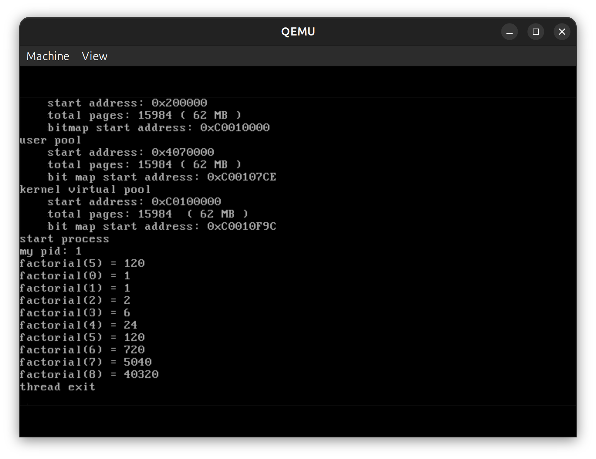

用户进程 `a1_process` 成功调用自定义的 `factorial` 系统调用，输出 factorial(0) 到 factorial(8) 的结果。可以看到：
- `factorial(5) = 120`、`factorial(7) = 5040`、`factorial(8) = 40320` 等计算结果均正确
- 系统调用机制工作正常：从用户态通过 `int 0x80` 进入内核态执行 `syscall_factorial` 计算，再通过 `iret` 返回用户态

#### 1.2 gdb 分析：系统调用入口（用户态）

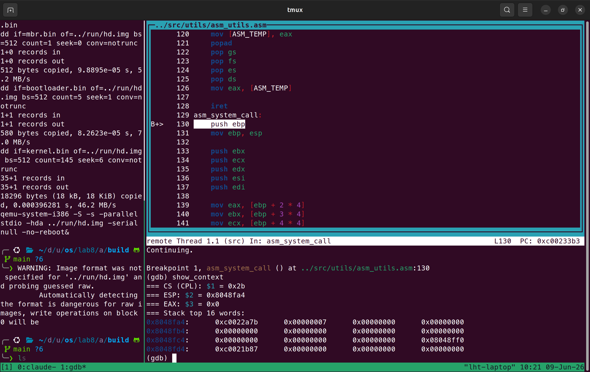

在 `asm_system_call` 入口处：

```
CS = 0x2b  → CPL = 3（用户态），段选择子低 2 位 = 11
ESP = 0x8048f14  → 用户栈地址（位于 USER_VADDR_START=0x8048000 以上）
```

栈顶为 `asm_system_call` 的返回地址和系统调用参数（系统调用号、参数字符串指针），验证了系统调用从用户态发起。

#### 1.3 gdb 分析：int 0x80 前后对比

**执行 `int 0x80` 之前**（`asm_system_call` 中，即将触发软中断）：

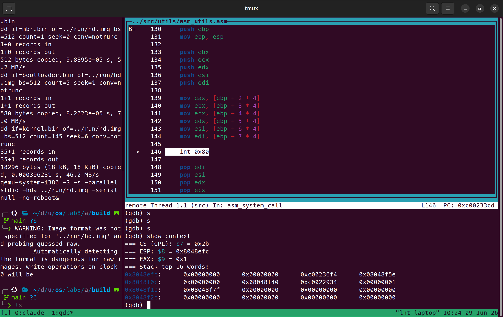

```
CS = 0x2b  → 仍在用户态
ESP = 0x8048efc  → 用户栈（push ebp/ebx/ecx/edx/esi/edi 之后）
```

**执行 `int 0x80` 之后**（进入 `asm_system_call_handler`）：

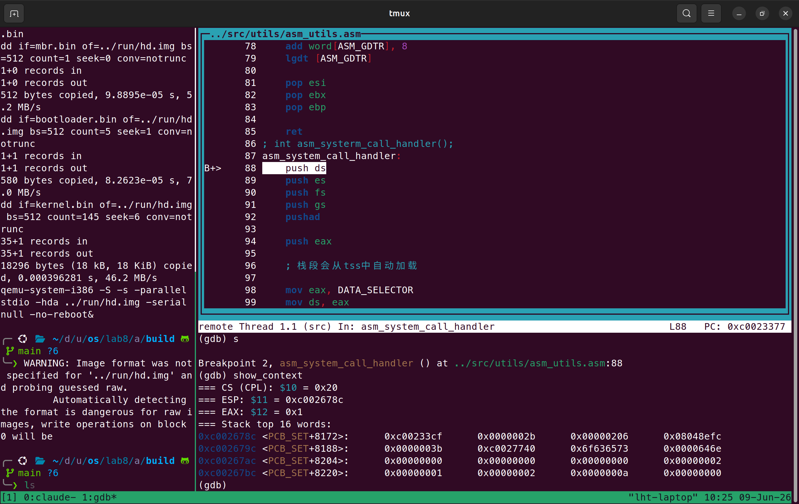

```
CS = 0x20  → 已切换为内核态（CPL=0）
ESP = 0xc002678c  → 内核栈（位于 PCB_SET 内，由 TSS.esp0 提供）
```

栈指针从 `0x8048efc` 变为 `0xc002678c`，确认发生了栈切换（特权级转移）。

#### 1.4 gdb 分析：内核栈全景（特权级转移证据）

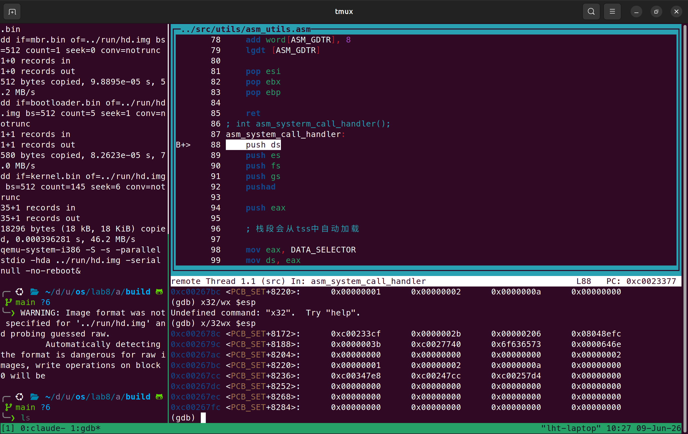

执行 `x/32wx $esp` 查看内核栈内容。最关键的 5 个 CPU 自动压入值：

```
ESP+0x0: 0xc00233cf  ← EIP（int 0x80 返回地址，位于 asm_system_call 中）
ESP+0x4: 0x0000002b  ← 旧 CS = 0x2b（用户代码段，CPL=3）
ESP+0x8: 0x00000206  ← EFLAGS
ESP+0xC: 0x08048efc  ← 旧 ESP（用户栈，与 1.3 中一致
ESP+0x10: 0x0000003b ← 旧 SS = 0x3b（用户栈段，RPL=3）
```

**这 5 个值表明特权级发生转移**。若 `int 0x80` 发生在内核态，CPU 仅压入 3 个值（EIP、CS、EFLAGS）；此处有额外的 SS 和 ESP，说明 CPU 发生了 CPL=3→0 的切换，TSS 被用来加载内核栈。

#### 1.5 gdb 分析：TSS 内容

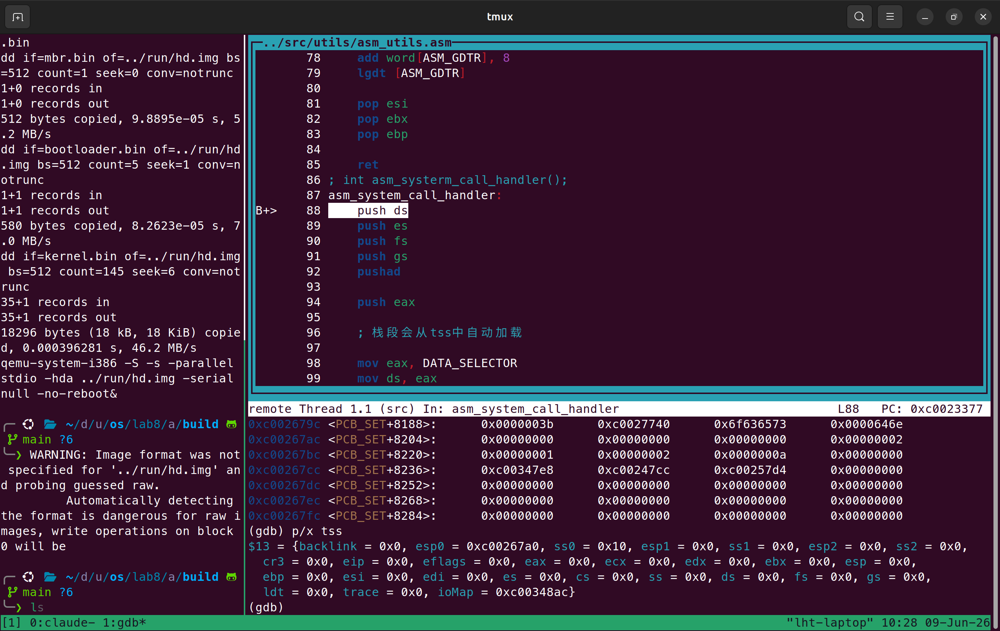

```
ss0 = 0x10  → STACK_SELECTOR（内核栈段选择子）
```

TSS 中的 `ss0` 字段在 `initializeTSS` 中被设置为 `STACK_SELECTOR = 0x10`。当 `int 0x80` 从用户态触发时，CPU 从 TSS 中读取 `ss0` 和 `esp0` 加载至 SS:ESP，完成向内核栈的切换。`esp0` 在进程调度时由 `activateProgramPage` 设置为 `(int)program + PAGE_SIZE`。

#### 1.6 gdb 分析：系统调用返回（回到用户态）

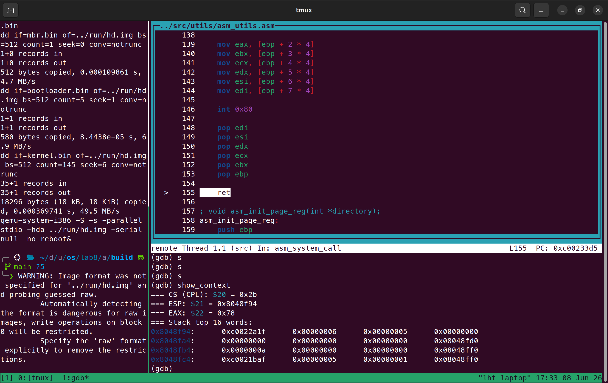

系统调用完成后返回到 `asm_system_call` 中的 `ret` 指令处：

```
CS = 0x2b  → 已恢复为用户态（CPL=3）
ESP = 0x8048f94  → 已恢复为用户栈
EAX = 0x78 = 120  → factorial(5) 的返回值
```

栈上可见返回地址 `0xc0022a1f`（位于 `factorial` 包装函数中），随后为系统调用参数（系统调用号=6，n=5）。EAX 中为正确计算结果 120，验证了系统调用返回值机制正确。

### Assignment 2：Fork 的奥秘

#### 2.1 QEMU 运行结果

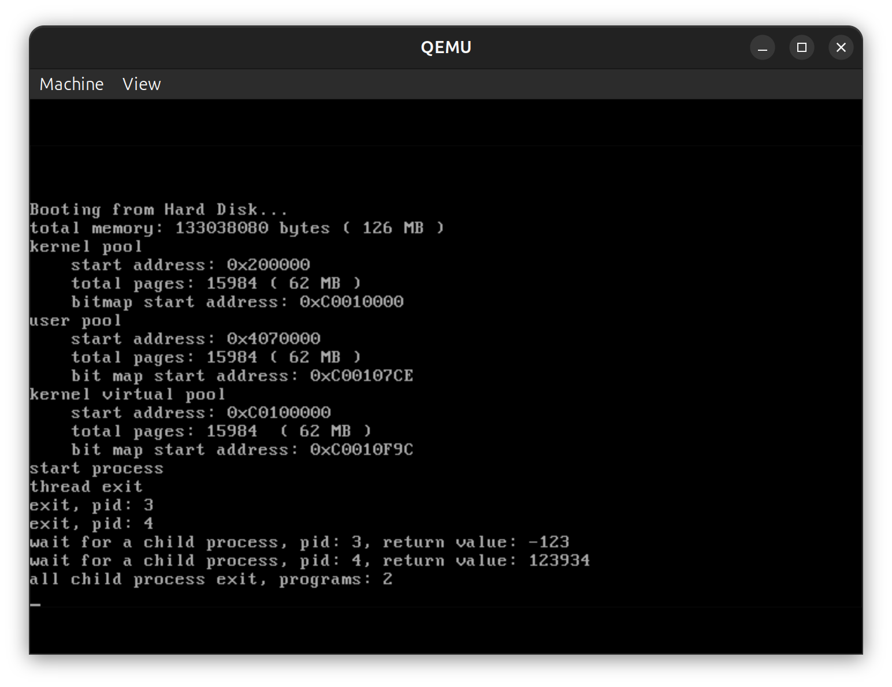

`a2_process` 的进程树如下：

```
a2_process (pid=1) ── fork ──┬── child1 (pid=3) ── exit(-123)
                             └── child2 (pid=4) ── exit(123934)
```

输出分析：
- `exit, pid: 3` — 第一个子进程退出，返回值 -123
- `exit, pid: 4` — 第二个子进程退出，返回值 123934
- `wait for a child process, pid: 3, return value: -123` — 父进程通过 wait 回收 child1
- `wait for a child process, pid: 4, return value: 123934` — 父进程回收 child2
- `all child process exit, programs: 2` — 所有子进程回收完毕，只剩 2 个程序（first_thread + second_thread）

验证了：**fork 调用两次，创建出两个独立子进程**；wait 按子进程退出顺序正确回收；子进程返回值（-123、123934）被父进程通过 wait 正确获取。

#### 2.2 gdb 分析：父进程进入 fork（系统调用号=2）

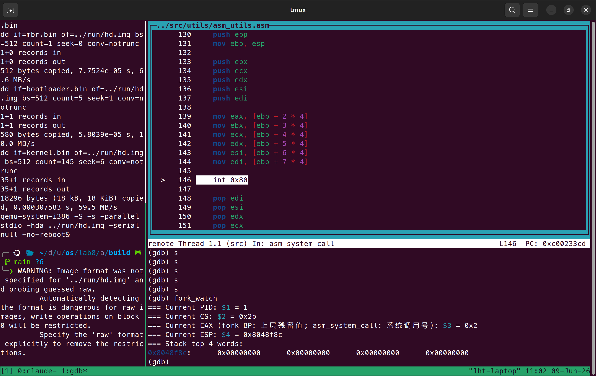

在 `asm_system_call` 内部、`int 0x80` 之前（已执行 `mov eax, [ebp+2*4]` 加载参数）：

```
PID = 1（a2_process，父进程）
CS = 0x2b（用户态，CPL=3）
EAX = 0x2（系统调用号=2，即 fork）
ESP = 0x8048f8c（用户栈）
```

#### 2.3 gdb 分析：copyProcess 中设置子进程 eax=0

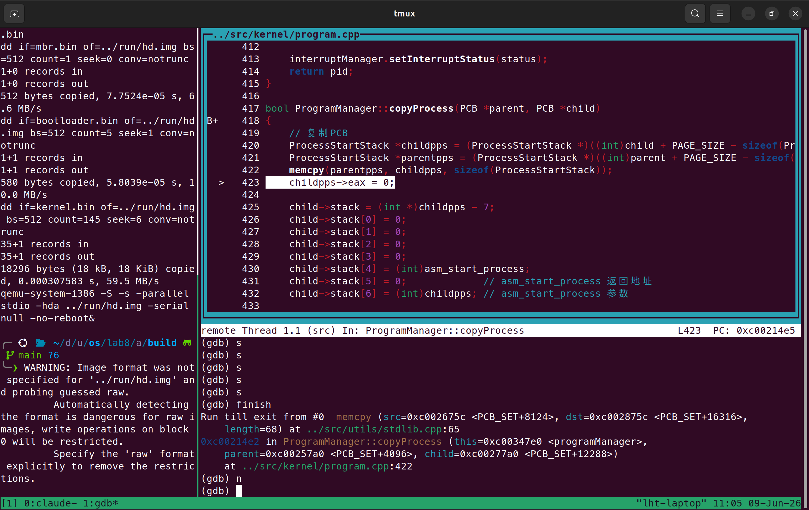

在 `ProgramManager::copyProcess` 中执行到 `childpps->eax = 0;` 语句。这是**fork 返回值的核心**，将子进程 `ProcessStartStack.eax` 设为 0，当子进程首次被调度时，`asm_start_process` 执行 `popad` 从该栈恢复寄存器，eax 被恢复为 0。因此子进程中 fork 返回 0。

#### 2.4 gdb 分析：子进程首次被调度（asm_start_process）

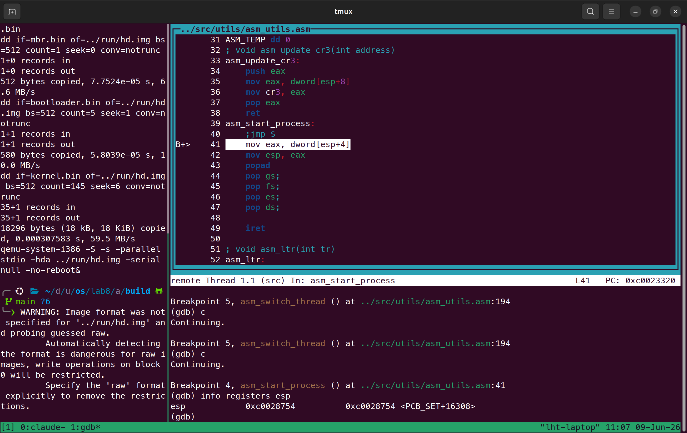

停在 `asm_start_process` 开头：

```
ESP = 0xc0028754（PCB_SET+16308，子进程的内核栈，从其 PCB->stack 切换而来）
```

此时是子进程第一次被调度执行。`asm_start_process` 即将执行 `mov eax, dword[esp+4]` → `mov esp, eax` 将 esp 指向 `ProcessStartStack`。

#### 2.5 gdb 分析：popad 后子进程 eax=0

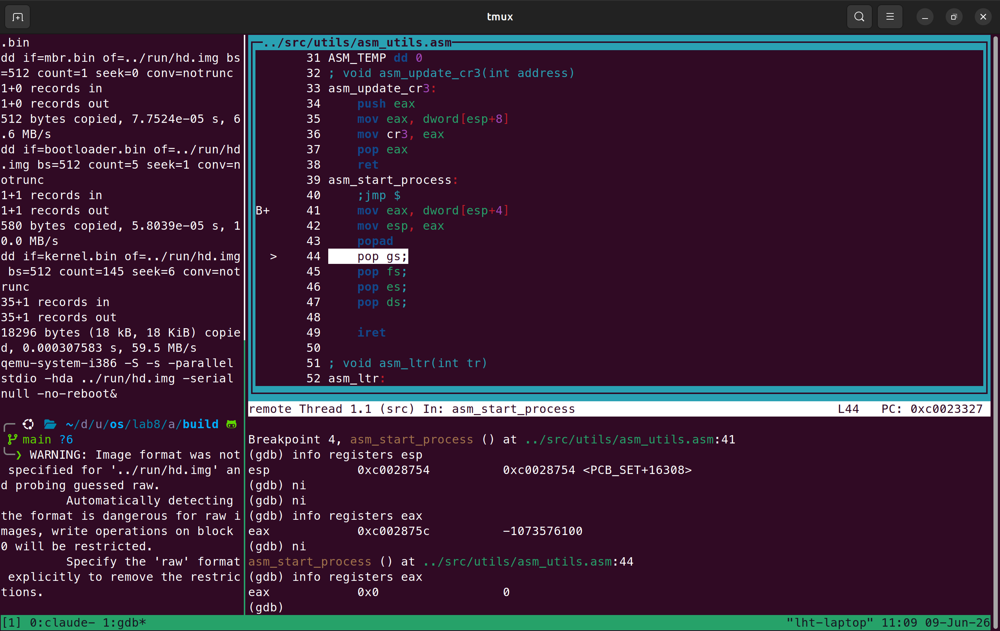

执行完 `popad` 后：

```
EAX = 0x0（子进程中 fork 的返回值！）
```

`popad` 从 `ProcessStartStack` 弹出 8 个通用寄存器，其中 eax 被恢复为 `childpps->eax = 0`（在 copyProcess 中设置的）。这就是**子进程中 fork 返回值为 0 的根本原因**。

对比父进程：父进程的 fork 返回值来自 `ProgramManager::fork()` 的 return 值（子进程 pid），通过 `mov [ASM_TEMP], eax` 保存，最终在 `asm_system_call_handler` 返回前通过 `mov eax, [ASM_TEMP]` 恢复。**父子进程的返回值来自完全不同的路径**——子进程从栈恢复 eax=0，父进程从内存变量恢复 eax=子进程 pid。

#### 2.6 gdb 分析：子进程段寄存器恢复

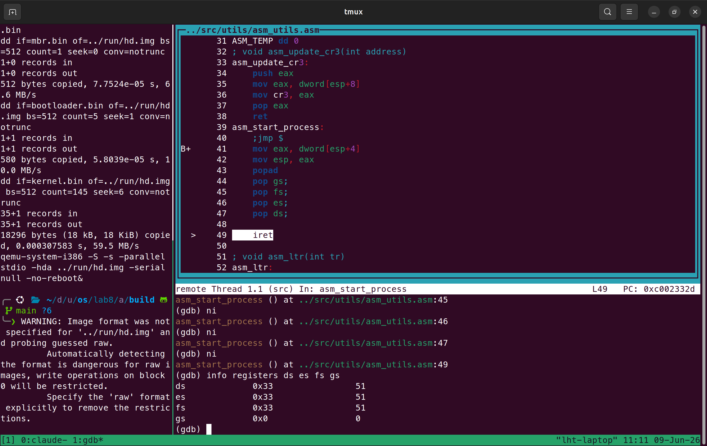

执行 `pop gs` / `pop fs` / `pop es` / `pop ds` 后：

```
DS = 0x33（USER_DATA_SELECTOR，DPL=3）
ES = 0x33（USER_DATA_SELECTOR）
FS = 0x33（USER_DATA_SELECTOR）
GS = 0x0
```

段寄存器被设置为用户数据段选择子（RPL=3），**子进程已具备用户态运行环境的全部条件**。GS 为 0 是因为 `ProcessStartStack.gs` 被设为 0（用户态不需要直接访问显存）。

#### 2.7 gdb 分析：iret 后子进程进入用户态

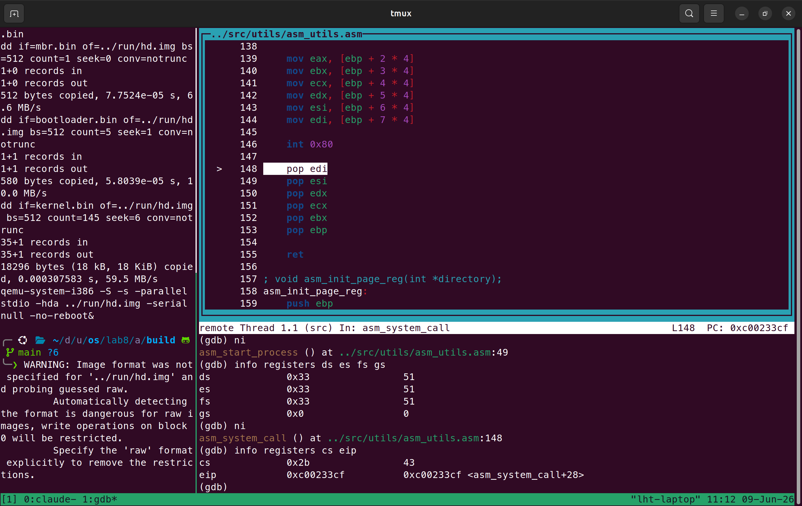

执行 `iret` 后：

```
CS = 0x2b（用户代码段，CPL=3）
EIP = 0xc00233cf（asm_system_call+28，即 int 0x80 的下一条指令）
```

`iret` 从 `ProcessStartStack` 中弹出 CS:EIP:EFLAGS:ESP:SS。关键在于 EIP = 父进程中 `int 0x80` 之后的返回地址——**父子进程从完全相同的代码位置继续执行**，即 `asm_system_call` 中 `int 0x80` 之后逐层返回到 `a2_process` 中 `fork()` 的返回点。这就是 fork 调用一次、返回两次的实现原理。

#### 2.8 父子进程返回路径对比

| 阶段 | 父进程 | 子进程 |
|------|--------|--------|
| eax 来源 | `mov eax, [ASM_TEMP]`（=子进程 pid） | `popad` 从 `ProcessStartStack.eax`（=0） |
| iret 后 EIP | `asm_system_call+28` | `asm_system_call+28`（相同） |
| 用户态返回 | `asm_system_call` ret → `fork()` 返回 pid | 同路径，`fork()` 返回 0 |

### Assignment 3：哼哈二将 wait & exit

#### 3.1 QEMU 运行结果：僵尸进程回收

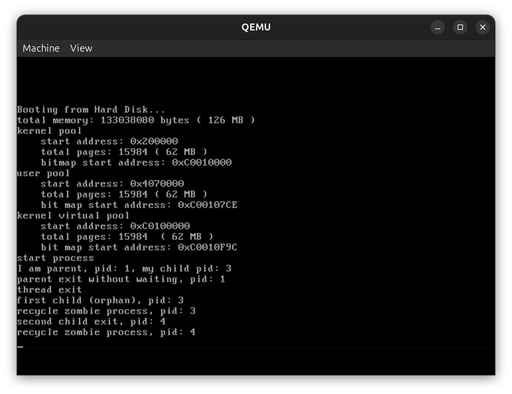

`a3_process` 的执行流程：父进程 fork 两个子进程后直接 exit（不调用 wait），子进程成为孤儿进程。两个子进程退出后，schedule 检测到父进程已死，自动回收僵尸进程。

```
I am parent, pid: 1, my child pid: 3
parent exit without waiting, pid: 1       ← 父进程直接退出
thread exit
first child (orphan), pid: 3              ← 子进程成为孤儿
recycle zombie process, pid: 3           ← schedule 自动回收僵尸
second child exit, pid: 4
recycle zombie process, pid: 4           ← 第二个僵尸也被回收
```

输出中 `recycle zombie process` 证明了僵尸进程回收机制工作正常——两个孤儿进程退出后均被 schedule 自动回收，没有遗留僵尸 PCB。

#### 3.2 gdb 分析：exit 入口

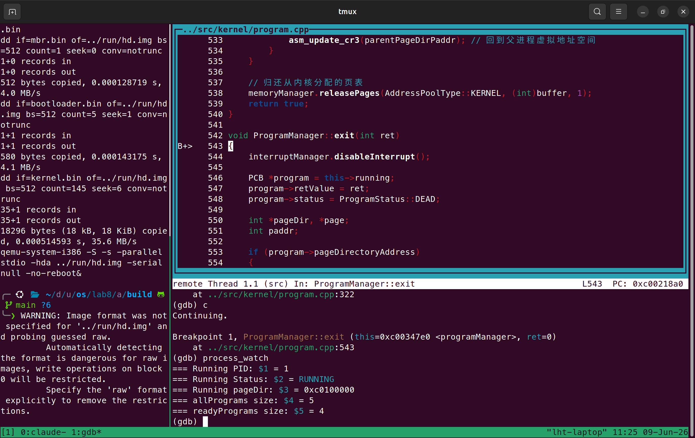

停在 `ProgramManager::exit` 入口：

```
Running PID = 1（父进程 a3_process）
Running Status = RUNNING → 即将变为 DEAD
Running pageDir = 0xc0100000（是进程，非线程，需要释放页表等资源）
allPrograms = 5, readyPrograms = 4
```

此时 exit 尚未执行，进程仍在 RUNNING 状态，相关资源（页目录表、虚拟地址池位图）尚未释放。

#### 3.3 gdb 分析：exit 调用 schedule 之前

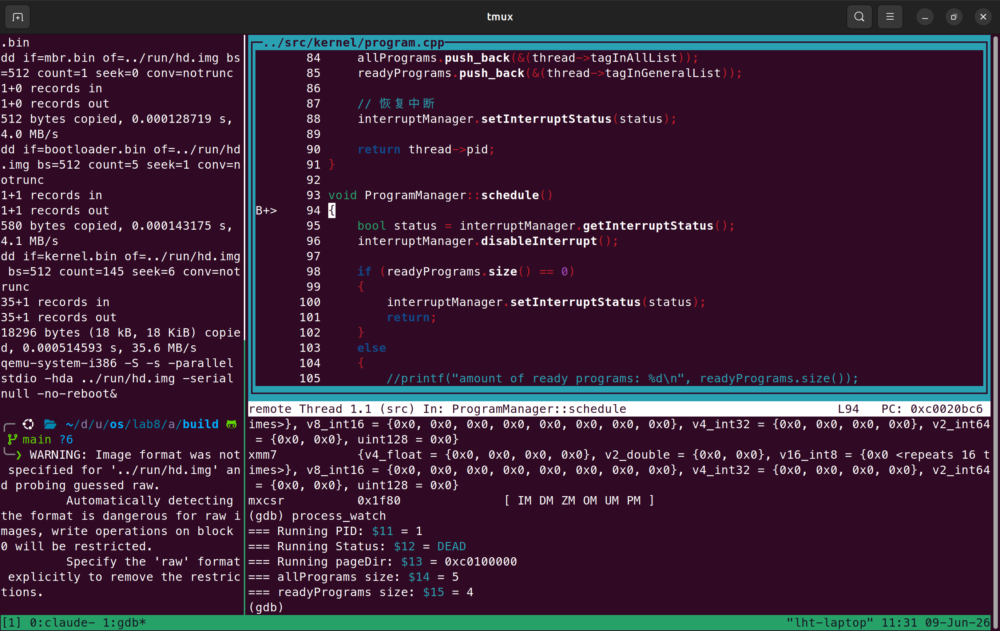

exit 函数末尾，资源释放完成后、`schedule()` 调用之前：

```
Running PID = 1
Running Status = DEAD                    ← 已标记为 DEAD
allPrograms = 5, readyPrograms = 4       ← PCB 仍在 allPrograms 中（尚未被回收）
```

资源（物理页、页表、页目录表、位图）已释放，进程状态变为 DEAD。此时若父进程调用 wait，可以回收此 PCB；若父进程也已 DEAD（如本例），则 schedule 将在僵尸进程被调度时自动回收。

#### 3.4 gdb 分析：wait 入口

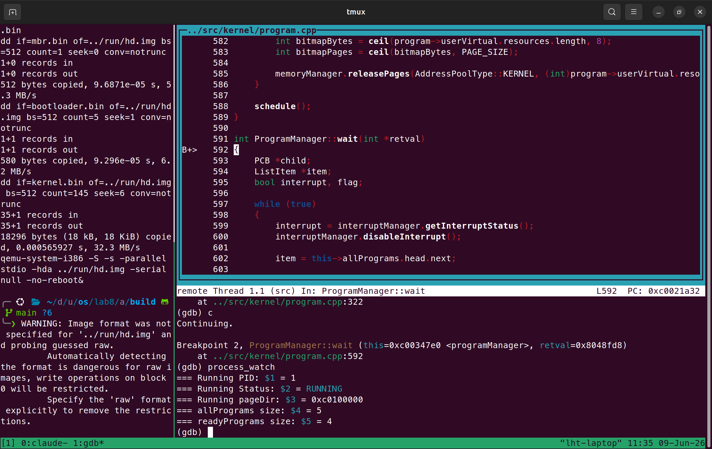

停在 `ProgramManager::wait` 入口（使用 a2_process 场景）：

```
Running PID = 1（父进程 a2_process）
Running Status = RUNNING
allPrograms = 5, readyPrograms = 4
```

父进程进入 wait，即将遍历 allPrograms 链表查找属于自己的 DEAD 子进程。

#### 3.5 gdb 分析：wait 找到 DEAD 子进程

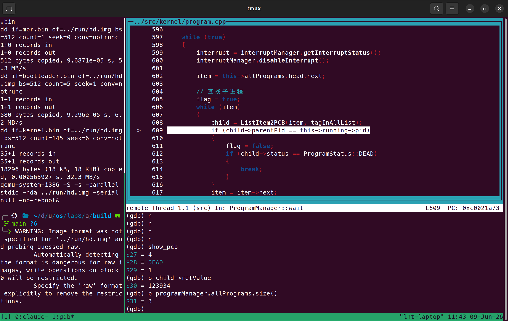

wait 遍历链表找到 DEAD 子进程：

```
child->pid = 4           ← 子进程 pid
child->status = DEAD     ← 子进程已退出
child->parentPid = 1     ← 确认为当前进程的子进程
child->retValue = 123934 ← 子进程退出返回值（匹配代码中的 exit(123934)）
allPrograms.size() = 3   ← releasePCB 前还有 3 个程序
```

通过 `child->parentPid == this->running->pid` 确认父子关系，`child->status == DEAD` 确认子进程已退出可回收。retValue=123934 与代码中 `exit(123934)` 一致。

#### 3.6 gdb 分析：wait 回收子进程 PCB

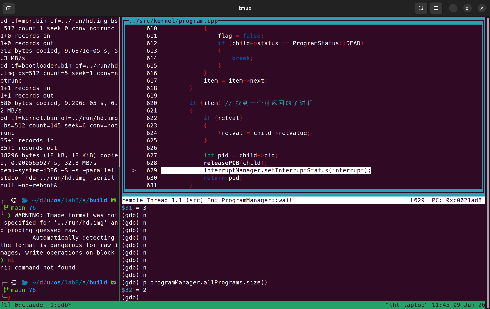

执行 `releasePCB(child)` 后：

```
allPrograms.size() = 2   ← PCB 被移除（只剩 first_thread 和 second_thread）
```

子进程 PCB 从 allPrograms 链表移除，PCB_SET_STATUS 对应位置标记为可用。wait 返回子进程 pid，父进程可以通过 retval 指针获取子进程返回值。

核心逻辑在 `schedule()` 中：当 running 为 DEAD 进程时，遍历 allPrograms 检查其父进程是否存活。若父进程不存在或已 DEAD，则直接回收此僵尸进程并打印 `recycle zombie process`；否则保留给父进程的 wait 回收。

## 总结

### 实验收获

1. **深入理解特权级机制**：通过实现从内核态到用户态的完整切换流程，深刻理解了 CPU 特权级（CPL/RPL/DPL）的概念、特权级检查规则（数据段 DPL≥max(CPL,RPL)、非一致代码段 CPL=DPL），以及两种特权级转移方式（低→高通过中断，高→低通过 iret）。

2. **掌握系统调用实现原理**：系统调用的本质是中断驱动的特权级转移。理解到参数必须通过寄存器传递（因为特权级转移导致栈切换，C 语言默认的栈传参方式失效），以及系统调用表的设计模式（以系统调用号为索引查表）。

3. **理解 TSS 的实际作用**：TSS 在本次实验中仅用于提供 0 特权级栈的地址（SS0/ESP0），这是从用户态进入内核态时栈切换的关键。虽有硬件任务切换的完整设计，但现代操作系统（包括 Linux）均采用自定义的进程切换方案。

4. **把握 Fork 的精妙设计**：fork 调用一次返回两次的关键在于：
   - 子进程复制了父进程的 0 特权级栈（保存中断返回上下文），使得 `iret` 后 EIP 相同
   - 子进程的 `ProcessStartStack.eax` 被设为 0，通过 `popad` 恢复使得 fork 返回 0
   - 借助内核中转页实现跨地址空间的数据复制

5. **理解进程生命周期管理**：exit 释放进程资源（物理页→页表→页目录表→位图），wait 实现父子进程同步（父进程阻塞等待子进程退出并回收 PCB），以及僵尸进程和孤儿进程的处理策略。

### 遇到的问题与解决

1. **用户进程无法使用 printf**：因为进程运行在 CPL=3，而显存访问需要 IOPL=0。解决方法是实现 write 系统调用，在内核态完成显存写入。

2. **系统调用参数传递失败**：因为特权级转移导致栈切换，C 函数的 ebp 寻址失效。学习到必须使用寄存器传递系统调用参数（最多 5 个），这与 Linux 的系统调用约定（eax=调用号，ebx/ecx/edx/esi/edi=参数）一致。

3. **fork 实现中跨地址空间数据复制的困难**：由于分页机制的隔离，父进程无法直接访问子进程的物理页。解决方案是从内核空间分配"中转页"——先在父进程空间复制数据到中转页，再切换到子进程空间从中转页复制到目标位置。

4. **僵尸进程的回收问题**：当父进程不调用 wait 或先于子进程退出时，子进程的 PCB 无法被回收。需要修改 schedule 逻辑，检查父进程是否存活；若父进程已退出，则由调度器直接回收子进程 PCB。

---

## 注

1. 请在报告首页填写好相关信息。
2. 实验报告需要将必要的实验过程和结果通过截图等方式放入报告内。并且可以在总结处附上自己解决问题的过程。
3. 锻炼实践能力，尽量自主解决遇到的问题，切忌抄袭。
4. 请将实验报告导出为PDF文件，并命名为 **学号+姓名.pdf** (如 `21210001李华.pdf`)
